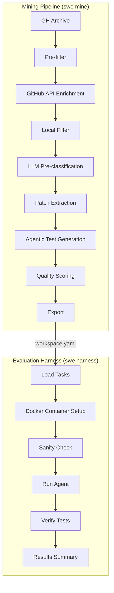
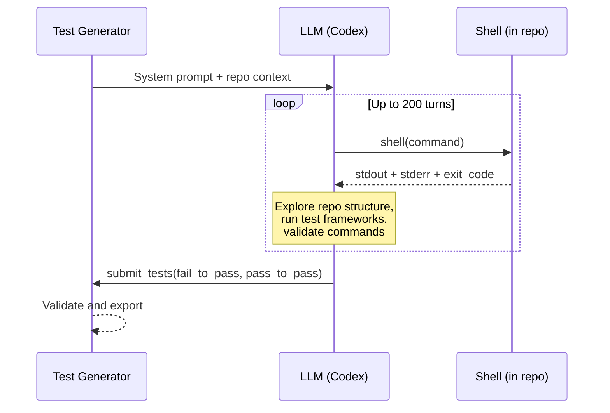
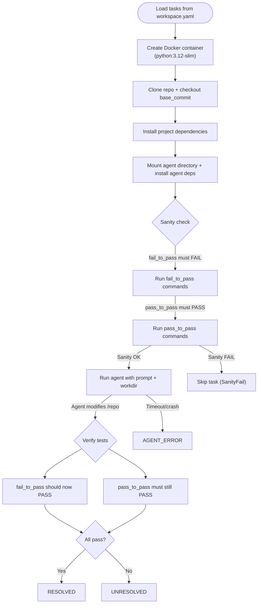
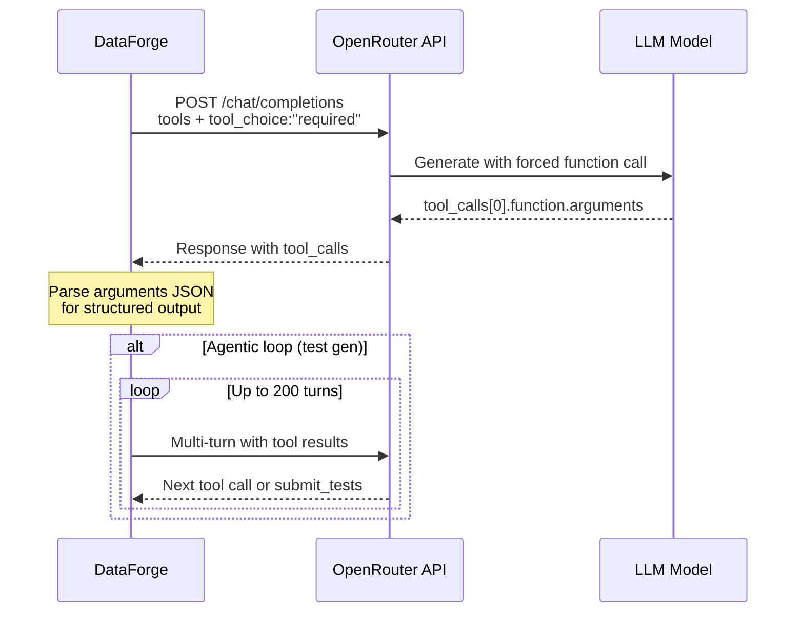

# swe-forge

[](https://www.rust-lang.org/)
[](LICENSE)

**High-performance SWE-bench dataset generator and evaluation harness that mines real GitHub pull requests, produces evaluation-ready task instances, and benchmarks coding agents.**

Built on top of [SweInfinite](https://github.com/unconst/SweInfinite) by [@unconst](https://github.com/unconst), extended for automated large-scale dataset generation with difficulty-based filtering, agentic test generation, structured LLM outputs, full parallelism, and a Docker-isolated evaluation harness.

## What it does

swe-forge connects to [GH Archive](https://www.gharchive.org/) to discover recently merged pull requests, enriches them via the GitHub API, classifies their difficulty using an LLM, generates test specifications via an agentic loop, and exports SWE-bench-compatible task instances. It also includes a full evaluation harness to run external coding agents on generated tasks and verify their solutions.

## Key features

- **Real GitHub data** — mines GH Archive for recently merged PRs across all public repositories. No synthetic data, no stubs, no fallbacks.
- **Difficulty filtering** — pre-classifies PRs as easy/medium/hard before expensive processing. Only spends LLM tokens on candidates matching your target difficulty.
- **Agentic test generation** — Codex-style multi-turn loop where the LLM clones the repo, explores the structure via shell, runs tests, and validates commands before submission (up to 200 turns).
- **Evaluation harness** — Docker-isolated execution of external agents on tasks, with sanity checks and per-test-command verification.
- **Aggressive parallelism** — GH Archive hours fetched 8x concurrent, enrichment 3x with rate limiting, pre-classification 10x, deep processing 3x.
- **Structured LLM outputs** — uses OpenAI-style function calling (`tools` + `tool_choice`) for reliable JSON parsing.
- **Streaming chunks** — processes candidates in batches of 30 to avoid burning GitHub API rate limits.
- **JSONL tracking** — auto-appends processed PRs to a JSONL file so re-runs skip already-seen PRs.

## Architecture overview



## Quick start

### Prerequisites

- Rust 1.70+
- [OpenRouter](https://openrouter.ai/) API key
- GitHub Personal Access Token (PAT) with public repo read access
- Docker (for the evaluation harness)

### Build

```bash
git clone https://github.com/CortexLM/swe-forge.git
cd swe-forge
cargo build --release
```

### Mine datasets

```bash
export OPENROUTER_API_KEY="sk-or-v1-..."
export GITHUB_TOKEN="ghp_..."

# Mine 10 hard tasks
cargo run -- swe mine \
  --output ./hard-tasks \
  --pr-file ./processed.jsonl \
  --max-tasks 10 \
  --difficulty hard \
  --once

# Mine 5 easy tasks (faster, more candidates match)
cargo run -- swe mine \
  --output ./easy-tasks \
  --max-tasks 5 \
  --difficulty easy \
  --once

# Mine without difficulty filter (accept all)
cargo run -- swe mine \
  --output ./all-tasks \
  --max-tasks 20 \
  --once
```

### Evaluate agents

```bash
# Run an agent on generated tasks
cargo run -- swe harness \
  --input ./hard-tasks \
  --agent-dir ./my-agent \
  --agent-cmd "python -m myagent" \
  --agent-timeout 600 \
  --parallel 2 \
  --json
```

### Output structure

Each task is exported as a directory:

```
hard-tasks/
  owner-repo-1234/
    workspace.yaml    # Full task metadata (SWE-bench compatible)
    prompt.md         # Task description for the agent
    checks.txt        # fail_to_pass + pass_to_pass test commands
```

## Mining pipeline

```mermaid
flowchart LR
    subgraph Fetch["GH Archive Fetch (8x)"]
        A1[Hour 1]
        A2[Hour 2]
        A3[Hour N]
    end

    subgraph Filter["Pre-filter"]
        B1["Merged PRs only"]
        B2["Exclude bots"]
        B3["Org repos only"]
    end

    subgraph Enrich["Enrichment (3x)"]
        C1["GitHub API"]
        C2["Title + Body"]
        C3["Diff + Files"]
    end

    subgraph Classify["Pre-classify (10x)"]
        D1["LLM triage"]
        D2["easy/medium/hard"]
    end

    subgraph Deep["Deep Processing (3x)"]
        E1["Git clone + diff"]
        E2["Agentic test gen"]
        E3["Quality scoring"]
    end

    F["Export workspace.yaml"]

    Fetch --> Filter
    Filter --> Enrich
    Enrich --> Classify
    Classify --> Deep
    Deep --> F
```



### Pipeline stages

| Stage | Parallelism | Rate limit | Description |
|-------|-------------|------------|-------------|
| GH Archive fetch | 8 concurrent | None | Download hourly event dumps |
| Pre-filter | N/A | None | Exclude bots, non-org repos, invalid PRs |
| Enrichment | 3 concurrent | GitHub 5000/h | Fetch PR metadata via GitHub API |
| Local filter | N/A | None | Language, stars, files changed |
| Pre-classification | 10 concurrent | OpenRouter | Fast LLM triage on title+body |
| Patch extraction | 3 concurrent | None | Git clone + diff extraction |
| Test generation | 3 concurrent | OpenRouter | Agentic LLM generates and validates test commands |
| Quality scoring | 3 concurrent | OpenRouter | LLM classifies difficulty + quality gate |

## Agentic test generation

The test generator uses a Codex-style multi-turn agentic loop instead of single-shot LLM calls:



The agent has access to two tools:
- **`shell`** — execute any command in the cloned repository (explore, install deps, run tests)
- **`submit_tests`** — submit validated `fail_to_pass` and `pass_to_pass` test commands

## Evaluation harness

The harness executes external coding agents on mined tasks inside Docker containers and verifies results:



### Harness statuses

| Status | Meaning |
|--------|---------|
| `resolved` | All fail_to_pass now pass + all pass_to_pass still pass |
| `unresolved` | Agent ran but some tests still fail |
| `agent_error` | Agent crashed or timed out |
| `test_error` | Test execution itself failed |
| `setup_error` | Container/clone/install failed |
| `sanity_fail` | fail_to_pass tests already pass before agent (bad task) |

### Harness output (JSON)

```json
{
  "total": 6,
  "resolved": 4,
  "unresolved": 1,
  "agent_error": 1,
  "avg_agent_time_secs": 120.5,
  "results": [
    {
      "task_id": "lablup/backend.ai-8860",
      "repo": "lablup/backend.ai",
      "status": "resolved",
      "sanity_check": true,
      "agent_duration_secs": 142.3,
      "fail_to_pass": [
        {
          "command": "PYTHONPATH=src pytest -q tests/...",
          "exit_code": 0,
          "passed": true,
          "duration_ms": 3200
        }
      ],
      "pass_to_pass": [
        {
          "command": "pytest -q tests/unit/...",
          "exit_code": 0,
          "passed": true,
          "duration_ms": 1800
        }
      ]
    }
  ]
}
```

## Difficulty classification

The LLM classifies each PR into three tiers based on the scope and complexity of changes:

| Level | Score | Typical changes | Examples |
|-------|-------|-----------------|----------|
| **Easy** | 0.1 -- 0.35 | Typo fixes, config changes, single-file edits | Fix import, update version, rename variable |
| **Medium** | 0.4 -- 0.65 | Bug fixes, feature additions, API changes | Fix race condition, add endpoint, refactor module |
| **Hard** | 0.7 -- 1.0 | Cross-cutting changes, architectural refactors | New subsystem, protocol change, major migration |

Pre-classification uses only the PR title and body (~100 tokens, ~0.5s). Full classification uses the complete diff and test spec.

## CLI reference

### `swe mine`

```
swe-forge swe mine [OPTIONS]

Options:
  -o, --output <DIR>          Output directory [default: ./swe-datasets]
  -m, --model <MODEL>         OpenRouter model [default: moonshotai/kimi-k2.5:nitro]
  -n, --max-tasks <N>         Number of tasks to generate [default: 1]
  -d, --difficulty <LEVEL>    Filter: easy, medium, hard [optional]
      --min-stars <N>         Minimum repo stars [default: 20]
      --languages <LIST>      Comma-separated language filter [optional]
      --pr-file <PATH>        JSONL file to track processed PRs [optional]
      --once                  Run once then exit (vs continuous)
      --api-key <KEY>         OpenRouter API key (or OPENROUTER_API_KEY env)
```

### `swe harness`

```
swe-forge swe harness [OPTIONS] --agent-dir <AGENT_DIR>

Options:
  -i, --input <INPUT>                 Directory containing SWE workspaces [default: ./generated-swe]
      --agent-dir <AGENT_DIR>         Path to the agent directory
      --agent-cmd <AGENT_CMD>         Command to run the agent [default: "python -m baseagent"]
      --agent-timeout <SECS>          Agent timeout in seconds [default: 600]
      --test-timeout <SECS>           Per-test command timeout [default: 120]
      --docker-image <IMAGE>          Base Docker image [default: python:3.12-slim]
      --parallel <N>                  Concurrent evaluations [default: 1]
      --keep-containers               Keep containers after evaluation (debugging)
  -j, --json                          Output results as JSON
```

### `swe validate`

```
swe-forge swe validate [OPTIONS]

Options:
  -i, --input <DIR>           Input directory with SWE workspaces [default: ./generated-swe]
      --api-key <KEY>         OpenRouter API key
  -j, --json                  JSON output
```

### `swe export`

```
swe-forge swe export [OPTIONS]

Options:
  -i, --input <DIR>           Input directory [default: ./generated-swe]
  -o, --output <DIR>          Output directory [default: ./exported-swe]
  -j, --json                  JSON output
```

## LLM function calling



All LLM interactions use function calling (`tools` + `tool_choice: "required"`) for reliable structured outputs:
- **DifficultyValidatorAgent** — returns `{ classification, score, reasoning }`
- **TestDesignerAgent** — returns `{ fail_to_pass, pass_to_pass }` after agentic exploration
- **QualityScorer** — returns `{ classification, score, reasoning }`

## Rate limit management

GitHub API allows 5000 requests/hour per token. The pipeline processes candidates in chunks of 30 (each needing ~2 API calls for enrichment). Only candidates that pass the GH Archive pre-filter (org repos, no bots, valid PRs) are enriched.

## Configuration

### Environment variables

| Variable | Required | Description |
|----------|----------|-------------|
| `OPENROUTER_API_KEY` | Yes | OpenRouter API key for LLM calls |
| `GITHUB_TOKEN` | Yes | GitHub PAT for PR enrichment |
| `RUST_LOG` | No | Log level: `error`, `warn`, `info`, `debug`, `trace` |

### Model selection

The default model is `moonshotai/kimi-k2.5:nitro` via OpenRouter. Any OpenRouter-compatible model that supports function calling can be used:

```bash
cargo run -- swe mine --model anthropic/claude-sonnet-4 --max-tasks 5
```

## Development

```bash
cargo build          # Build
cargo test           # Run tests (1251 tests)
cargo clippy         # Lint
RUST_LOG=debug cargo run -- swe mine --max-tasks 1 --once  # Debug run
```

## Credits

Built on top of [SweInfinite](https://github.com/unconst/SweInfinite) by [@unconst](https://github.com/unconst). The original architecture for mining GitHub PRs and generating SWE-bench-style datasets was designed by the SweInfinite team. swe-forge extends it with:

- Difficulty-based pre-classification and filtering
- Agentic test generation (Codex-style multi-turn loop with shell access)
- Docker-isolated evaluation harness for benchmarking agents
- OpenAI-style function calling for structured LLM outputs
- Full pipeline parallelism (GH Archive, enrichment, LLM calls)
- Streaming chunk processing with rate limit management
- JSONL-based PR tracking (replaces SQLite)

## License

MIT — see [LICENSE](LICENSE).
