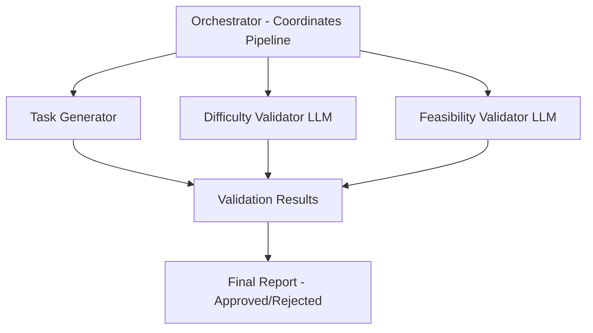

# dataforge

[](LICENSE)
[](https://www.rust-lang.org/)

**Synthetic benchmark task generator for LLM evaluation with multi-agent validation.**

dataforge generates synthetic terminal/CLI benchmark tasks to evaluate AI agent capabilities. It uses a multi-agent validation system to ensure generated tasks match the requested difficulty level, are solvable but challenging, and meet quality standards.

## Features

### Multi-Agent Validation System

Four specialized agents work together to validate task quality in real-time:

| Agent | Role | Description |
|-------|------|-------------|
| **Task Generator** | `[creating task]` | Creates tasks from YAML templates with variable interpolation |
| **Difficulty Validator** | `[validate difficulty]` | Uses LLM to verify task matches expected difficulty level |
| **Feasibility Validator** | `[validate feasibility]` | Ensures tasks are solvable but not trivial |
| **Orchestrator** | `[final approval]` | Coordinates pipeline and makes final decisions |

### Interactive TUI with Ratatui

Real-time visualization of agent activity with:
- **Tree-based progress display** showing pipeline stages
- **Difficulty selection panel** (Easy/Medium/Hard)
- **Agent reasoning panel** with live updates
- **Status indicators**: `pending`, `running`, `completed`, `failed`

### JSON Output Mode

Skip the TUI for CI/CD integration:
```bash
dataforge tui --json --difficulty hard --seed 12345
```

### Difficulty Levels

| Level | Steps | Time | Success Rate |
|-------|-------|------|--------------|
| **Easy** | 1-3 commands | 30s-2min | 90% |
| **Medium** | 3-8 commands | 2-10min | 70% |
| **Hard** | 8-20 commands | 10-30min | 40% |

### Additional Features

- **Template System** - YAML-based templates with Tera templating
- **Task Registry** - Lifecycle management (draft, review, published, deprecated)
- **HuggingFace Export** - Dataset export for ML workflows
- **Anti-Hardcoding** - Canary tokens to detect memorization

## Installation

### Prerequisites

- Rust toolchain (1.70.0 or later)
- Cargo package manager
- LLM API access (OpenRouter, LiteLLM proxy, or compatible endpoint)

### Build from Source

```bash
# Clone the repository
git clone https://github.com/dataforge/dataforge.git
cd dataforge

# Build in release mode
cargo build --release

# The binary will be at target/release/dataforge
```

### Quick Install

```bash
cargo install --path .
```

## Quick Start

### 1. Set up LLM Integration

dataforge supports multiple LLM providers via an OpenAI-compatible API:

```bash
# Option A: Using OpenRouter (recommended)
export LITELLM_API_BASE="https://openrouter.ai/api/v1"
export LITELLM_API_KEY="sk-or-v1-your-key-here"

# Option B: Using local LiteLLM proxy
export LITELLM_API_BASE="http://localhost:4000"
export LITELLM_API_KEY="your-api-key"  # Optional

# Option C: Direct OpenAI
export LITELLM_API_BASE="https://api.openai.com/v1"
export LITELLM_API_KEY="sk-your-openai-key"
```

### 2. Launch Interactive TUI

```bash
dataforge tui
```

**TUI Controls:**

| Key | Action |
|-----|--------|
| `Up/Down` or `k/j` | Navigate selection |
| `Space` | Start validation pipeline |
| `Tab` | Switch between panels |
| `q` or `Esc` | Quit |

### 3. Generate Tasks (JSON Output)

```bash
# Skip TUI, output JSON directly
dataforge tui --json --difficulty hard --seed 12345
```

Output:
```json
{
  "status": "approved",
  "difficulty": "hard",
  "seed": 12345,
  "task_id": "task-abc12345",
  "validations": [...],
  "final_score": 0.85,
  "reasoning": "Task approved with high confidence"
}
```

### 4. Generate Task Instances from Template

```bash
dataforge generate --template log-analysis-001 --seed 42 --output ./output
```

### 5. Validate a Task

```bash
dataforge validate --path ./output/task-001 --validate-type task
```

## CLI Usage

### Commands

```
dataforge <COMMAND>

Commands:
  tui        Launch the interactive TUI for task validation
  generate   Generate task instances from templates
  validate   Validate a task or template
  registry   Manage task registry
  export     Export dataset
  templates  List available templates
  init       Initialize a new template
  help       Print help information
```

### TUI Mode

Launch the interactive terminal user interface:

```bash
# Default TUI with medium difficulty
dataforge tui

# JSON output mode (skip TUI)
dataforge tui --json

# Specify difficulty and seed
dataforge tui --json --difficulty hard --seed 12345

# Use a specific template
dataforge tui --template log-analysis-001
```

**Options:**
- `-j, --json` - Output JSON to stdout instead of TUI
- `-d, --difficulty <LEVEL>` - Difficulty level: easy, medium, hard (default: medium)
- `-s, --seed <SEED>` - Random seed for reproducibility
- `-t, --template <ID>` - Template ID or path to template file

### Generate Tasks

Generate task instances from templates:

```bash
# Generate single task
dataforge generate --template debug-001 --seed 42 --output ./output

# Generate multiple instances
dataforge generate --template debug-001 --seed 42 --output ./output --count 10
```

**Options:**
- `-t, --template <ID>` - Template ID or file path (required)
- `-s, --seed <SEED>` - Random seed (required)
- `-o, --output <DIR>` - Output directory (default: ./output)
- `-c, --count <N>` - Number of instances to generate (default: 1)

### Validate

Validate templates or generated tasks:

```bash
# Validate a template file
dataforge validate --path ./templates/my-template.yaml --validate-type template

# Validate a generated task
dataforge validate --path ./output/task-001 --validate-type task
```

**Options:**
- `-p, --path <PATH>` - Path to template file or task directory (required)
- `-t, --validate-type <TYPE>` - Validation type: template, task (default: task)

### Registry Management

Manage the task registry:

```bash
# List all registered tasks
dataforge registry list

# Filter by status
dataforge registry list --status published

# Filter by category
dataforge registry list --category debugging

# Add a task to registry
dataforge registry add --path ./output/task-001

# Update task status
dataforge registry status --task-id task-abc123 --new-status published

# Show task details
dataforge registry show --task-id task-abc123
```

**Status values:** draft, review, published, deprecated

### Export Dataset

Export tasks in various formats:

```bash
# Export in HuggingFace format
dataforge export --output ./dist --version v1.0.0 --format huggingface

# Export as JSON
dataforge export --output ./dist --version v1.0.0 --format json

# Include solutions in export
dataforge export --output ./dist --version v1.0.0 --include-solutions
```

**Options:**
- `-o, --output <DIR>` - Output directory (required)
- `-v, --version <TAG>` - Version tag (required)
- `-f, --format <FMT>` - Export format: huggingface, json (default: huggingface)
- `--include-solutions` - Include reference solutions in export

### Templates

List and manage templates:

```bash
# List all templates
dataforge templates

# Filter by category
dataforge templates --category debugging

# Filter by difficulty
dataforge templates --difficulty hard
```

### Initialize New Template

Create a new template scaffold:

```bash
dataforge init --id my-task-001 --category debugging --output ./templates
```

This creates a YAML template file ready for customization.

## Environment Variables

| Variable | Description | Required |
|----------|-------------|----------|
| `LITELLM_API_BASE` | Base URL for LiteLLM API endpoint | Yes |
| `LITELLM_API_KEY` | API key for LiteLLM authentication | No |
| `RUST_LOG` | Log level (trace, debug, info, warn, error) | No |

## Architecture Overview

dataforge uses a multi-agent architecture for task validation:



**Pipeline Stages:**

1. **Task Generation** - Create task from template with parameters
2. **Difficulty Validation** - LLM verifies task matches expected difficulty
3. **Feasibility Validation** - LLM ensures task is solvable but not trivial
4. **Final Approval** - Aggregate scores and make approval decision

For detailed architecture documentation, see [docs/architecture.md](docs/architecture.md).

## Template Format

Templates use YAML format with Tera templating:

```yaml
id: "my-task-001"
version: "1.0.0"
category: "debugging"
subcategory: "log-analysis"

difficulty:
  estimated: "medium"
  time_range: [120, 600]
  command_steps: [3, 8]

instruction_template: |
  Analyze the log file at {{ log_path }} and find all ERROR entries.
  Count the total number of errors and report the most common error type.

reference_solution: |
  #!/bin/bash
  grep 'ERROR' {{ log_path }} | wc -l
  grep 'ERROR' {{ log_path }} | awk '{print $NF}' | sort | uniq -c | sort -rn | head -1

variables:
  - name: log_path
    type: string
    generator: path
    options:
      prefix: "/var/log"
      extensions: [".log"]
```

For detailed template documentation, see [docs/usage.md](docs/usage.md).

## Contributing

Contributions are welcome. Please follow these guidelines:

1. Fork the repository
2. Create a feature branch (`git checkout -b feature/my-feature`)
3. Make your changes with clear commit messages
4. Ensure tests pass (`cargo test`)
5. Run clippy (`cargo clippy -- -D warnings`)
6. Format code (`cargo fmt`)
7. Submit a pull request

### Development Setup

```bash
# Clone and build
git clone https://github.com/dataforge/dataforge.git
cd dataforge
cargo build

# Run tests
cargo test

# Run with debug logging
RUST_LOG=debug cargo run -- tui
```

## License

This project is licensed under the MIT License - see the [LICENSE](LICENSE) file for details.

## Related Documentation

- [Usage Guide](docs/usage.md) - Detailed usage instructions
- [Architecture](docs/architecture.md) - Technical architecture details
