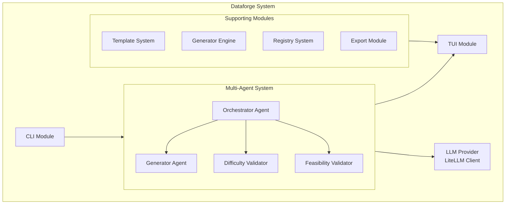
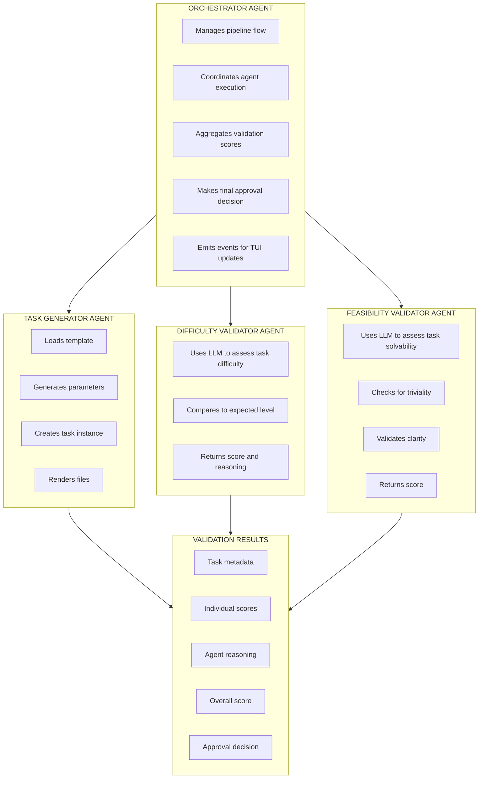
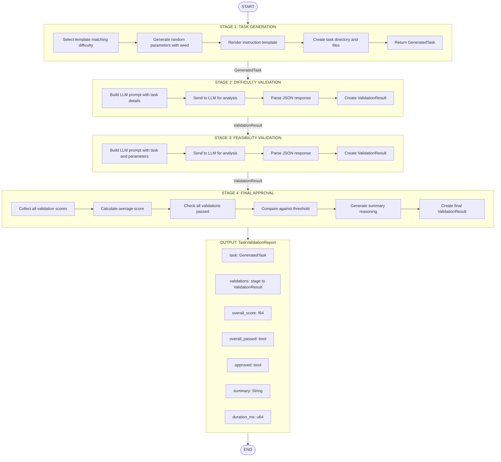
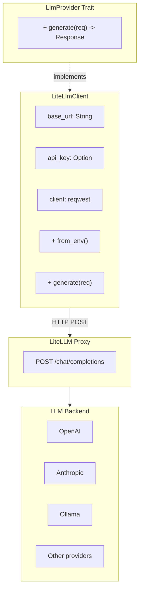
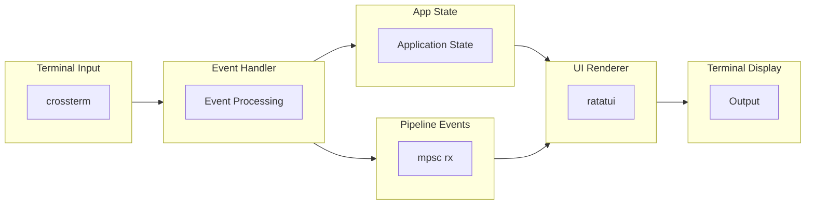

# Dataforge Architecture

This document describes the technical architecture of Dataforge, including the multi-agent system design, pipeline flow, and component interactions.

## Table of Contents

- [System Overview](#system-overview)
- [Multi-Agent System](#multi-agent-system)
- [Pipeline Flow](#pipeline-flow)
- [LLM Integration](#llm-integration)
- [TUI Event System](#tui-event-system)
- [Module Structure](#module-structure)

## System Overview

Dataforge is built as a modular Rust application with the following high-level architecture:



## Multi-Agent System

The multi-agent system consists of four specialized agents that work together to validate generated tasks.

### Agent Overview



### Task Generator Agent

**Purpose:** Creates benchmark tasks from templates with randomized parameters.

**Responsibilities:**
- Load and parse task templates
- Generate random parameters based on variable definitions
- Render task instructions using Tera templating
- Create task directory structure
- Generate supporting files (logs, configs, etc.)

**Input:**
- Template ID or template object
- Difficulty level
- Random seed

**Output:**
- `GeneratedTask` containing:
  - Task ID
  - Rendered instructions
  - Generated parameters
  - File paths
  - Metadata

**Code Location:** `src/agents/generator.rs`

### Difficulty Validator Agent

**Purpose:** Uses LLM to verify that a generated task matches the expected difficulty level.

**Responsibilities:**
- Analyze task instructions and parameters
- Compare against difficulty level characteristics
- Estimate number of command steps required
- Evaluate domain knowledge requirements
- Return score and detailed reasoning

**Evaluation Criteria:**
1. Number of distinct steps required
2. Level of domain knowledge needed
3. Complexity of command syntax
4. Need for troubleshooting or iteration
5. Clarity vs ambiguity of instructions

**Input:**
- `GeneratedTask`
- Expected `DifficultyLevel`

**Output:**
- `ValidationResult` with:
  - Score (0.0 - 1.0)
  - `matches_difficulty` boolean
  - Detailed reasoning
  - Estimated steps
  - Issues list

**Code Location:** `src/agents/difficulty_validator.rs`

### Feasibility Validator Agent

**Purpose:** Uses LLM to ensure tasks are solvable but not trivial.

**Responsibilities:**
- Verify task can be completed with standard Linux tools
- Ensure task requires actual problem-solving
- Check instruction clarity
- Validate task self-containment

**Evaluation Criteria:**
1. **Solvability:** Can be completed with bash, grep, awk, sed, find, etc.
2. **Non-triviality:** Requires thinking, not just copy-paste commands
3. **Clarity:** Instructions are unambiguous and complete
4. **Independence:** No external resources required

**Red Flags Detected:**
- Proprietary software requirements
- Missing file references
- Logical contradictions
- Single obvious command solutions
- Solution directly stated in instructions

**Input:**
- `GeneratedTask`

**Output:**
- `ValidationResult` with:
  - Score (0.0 - 1.0)
  - `is_solvable` boolean
  - `is_non_trivial` boolean
  - `is_clear` boolean
  - Detailed reasoning
  - Solvability and complexity notes
  - Issues list

**Code Location:** `src/agents/feasibility_validator.rs`

### Orchestrator Agent

**Purpose:** Coordinates the validation pipeline and makes final approval decisions.

**Responsibilities:**
- Initialize and configure all agents
- Execute pipeline stages in sequence
- Handle stage failures gracefully
- Aggregate validation scores
- Make final approval decision
- Emit events for TUI updates

**Configuration:**
```rust
OrchestratorConfig {
    generator_config: GeneratorAgentConfig,
    difficulty_validator_config: DifficultyValidatorConfig,
    feasibility_validator_config: FeasibilityValidatorConfig,
    final_approval_threshold: 0.7,
    continue_on_failure: false,
}
```

**Approval Logic:**
1. Calculate average score from all validations
2. Check if all validations passed
3. Compare against approval threshold
4. Generate summary with reasoning

**Code Location:** `src/agents/orchestrator.rs`

## Pipeline Flow

The validation pipeline executes in four stages:



**Decision Logic:**
- APPROVED: score >= threshold AND all validations passed
- REJECTED: score < threshold OR any validation failed

**Events:** StageStarted, StageCompleted, StageFailed, PipelineCompleted

### Pipeline Events

Events emitted during pipeline execution for TUI updates:

```rust
pub enum PipelineEvent {
    /// Stage started executing
    StageStarted {
        stage: PipelineStage,
        timestamp: DateTime<Utc>,
    },
    
    /// Stage completed successfully
    StageCompleted {
        stage: PipelineStage,
        result: ValidationResult,
        timestamp: DateTime<Utc>,
    },
    
    /// Stage failed with error
    StageFailed {
        stage: PipelineStage,
        error: String,
        timestamp: DateTime<Utc>,
    },
    
    /// Agent provided reasoning (for progress updates)
    AgentReasoning {
        stage: PipelineStage,
        reasoning: String,
        timestamp: DateTime<Utc>,
    },
    
    /// Entire pipeline completed
    PipelineCompleted {
        report: TaskValidationReport,
    },
    
    /// Pipeline failed
    PipelineFailed {
        error: String,
        timestamp: DateTime<Utc>,
    },
}
```

### Pipeline Stages Enum

```rust
pub enum PipelineStage {
    TaskGeneration,
    DifficultyValidation,
    FeasibilityValidation,
    FinalApproval,
}
```

## LLM Integration

Dataforge uses a trait-based LLM integration for flexibility:



### Request/Response Types

```rust
pub struct GenerationRequest {
    pub model: String,
    pub messages: Vec<Message>,
    pub temperature: Option<f64>,
    pub max_tokens: Option<u32>,
}

pub struct GenerationResponse {
    pub id: String,
    pub model: String,
    pub choices: Vec<Choice>,
    pub usage: Usage,
}

pub struct Message {
    pub role: String,    // "system", "user", "assistant"
    pub content: String,
}
```

### Environment Configuration

```bash
# Required
LITELLM_API_BASE="http://localhost:4000"

# Optional
LITELLM_API_KEY="your-key"
```

## TUI Event System

The TUI uses an event-driven architecture with async channels:



### Event Types

```rust
pub enum Event {
    /// Terminal tick (for animations)
    Tick,
    
    /// Keyboard input
    Key(KeyEvent),
    
    /// Terminal resize
    Resize(u16, u16),
    
    /// Pipeline event from orchestrator
    Pipeline(PipelineEvent),
}
```

### Event Loop

```rust
loop {
    // 1. Draw UI
    terminal.draw(|f| ui::draw(f, &app))?;
    
    // 2. Handle events
    match event_handler.next().await? {
        Event::Key(key) => handle_key_input(&mut app, key),
        Event::Pipeline(event) => app.handle_pipeline_event(event),
        Event::Tick => { /* Animation updates */ },
        Event::Resize(w, h) => { /* Handle resize */ },
    }
    
    // 3. Check quit condition
    if app.should_quit() {
        break;
    }
}
```

### App State

The `App` struct maintains all TUI state:

```rust
pub struct App {
    pub running: bool,
    pub selected_difficulty: DifficultyLevel,
    pub difficulty_index: usize,
    pub pipeline_events: Vec<PipelineEvent>,
    pub current_stage: Option<PipelineStage>,
    pub stages: Vec<StageInfo>,
    pub validation_report: Option<TaskValidationReport>,
    pub pipeline_running: bool,
    pub current_seed: Option<u64>,
    pub current_task_id: Option<String>,
    pub focused_panel: usize,
    pub reasoning_text: Vec<String>,
    pub reasoning_scroll: usize,
}
```

## Module Structure

```
src/
├── main.rs              # Entry point, logging setup
├── lib.rs               # Library root, module exports
│
├── agents/              # Multi-agent system
│   ├── mod.rs           # Agent module exports
│   ├── generator.rs     # Task Generator Agent
│   ├── difficulty_validator.rs  # Difficulty Validator Agent
│   ├── feasibility_validator.rs # Feasibility Validator Agent
│   ├── orchestrator.rs  # Orchestrator Agent
│   ├── types.rs         # Shared types (GeneratedTask, ValidationResult, etc.)
│   └── error.rs         # Agent-specific errors
│
├── cli/                 # Command-line interface
│   ├── mod.rs           # CLI module exports
│   └── commands.rs      # Command definitions (clap)
│
├── tui/                 # Terminal user interface
│   ├── mod.rs           # TUI module exports
│   ├── app.rs           # Application state
│   ├── events.rs        # Event handler
│   ├── ui.rs            # UI rendering (ratatui)
│   ├── tree.rs          # Tree widget for pipeline
│   └── runner.rs        # TUI main loop
│
├── llm/                 # LLM integration
│   ├── mod.rs           # LLM module exports
│   └── litellm.rs       # LiteLLM client implementation
│
├── template/            # Template system
│   ├── mod.rs           # Template module exports
│   ├── schema.rs        # Template YAML schema
│   ├── types.rs         # Template types
│   └── variables.rs     # Variable generators
│
├── generator/           # Task generation
│   ├── mod.rs           # Generator module exports
│   ├── instance.rs      # Instance generation
│   ├── sampler.rs       # Parameter sampling
│   ├── solution.rs      # Solution generation
│   └── file_generators.rs # File generation
│
├── difficulty/          # Difficulty system
│   └── mod.rs           # Difficulty levels, scoring
│
├── registry/            # Task registry
│   ├── mod.rs           # Registry module exports
│   ├── entry.rs         # Registry entry types
│   ├── version.rs       # Version management
│   └── lifecycle.rs     # Status lifecycle
│
├── validation/          # Validation utilities
│   ├── mod.rs           # Validation module exports
│   ├── schema_validator.rs  # Schema validation
│   └── task_validator.rs    # Task validation
│
├── export/              # Export functionality
│   ├── mod.rs           # Export module exports
│   └── huggingface.rs   # HuggingFace format export
│
├── docker/              # Docker integration
│   ├── mod.rs           # Docker module exports
│   ├── compose.rs       # Docker Compose generation
│   ├── dockerfile.rs    # Dockerfile generation
│   └── resources.rs     # Resource limits
│
├── test_framework/      # Testing framework
│   ├── mod.rs           # Test framework exports
│   ├── pytest_generator.rs  # Pytest generation
│   ├── verification.rs  # Output verification
│   └── reward.rs        # Reward calculation
│
├── anti_hardcoding/     # Anti-hardcoding measures
│   ├── mod.rs           # Module exports
│   ├── canary.rs        # Canary token detection
│   ├── sealed.rs        # Sealed verification
│   └── process_validation.rs # Process validation
│
├── categories/          # Task categories
│   ├── mod.rs           # Category module exports
│   └── taxonomy.rs      # Category taxonomy
│
└── error.rs             # Error types
```

### Key Dependencies

| Crate | Purpose |
|-------|---------|
| `clap` | CLI argument parsing |
| `tokio` | Async runtime |
| `ratatui` | Terminal UI framework |
| `crossterm` | Terminal manipulation |
| `serde` | Serialization/deserialization |
| `serde_yaml` | YAML parsing |
| `tera` | Template rendering |
| `reqwest` | HTTP client for LLM |
| `tracing` | Logging and diagnostics |
| `uuid` | Unique ID generation |
| `chrono` | Date/time handling |
| `rand` | Random number generation |
