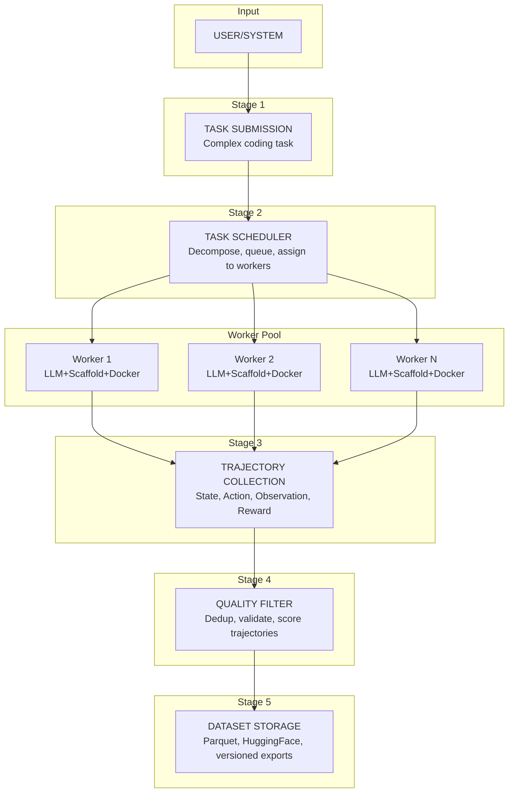

# System Overview - Synthetic Dataset Generation

## 1. What Are We Building?

A **Synthetic Dataset Generation System** that produces high-quality training data for Large Language Models (LLMs) by:

1. **Generating complex multi-step tasks** (10-100+ actions per task)
2. **Executing them in isolated Docker environments**
3. **Collecting complete trajectories** (state-action-observation-reward sequences)
4. **Storing and curating datasets** for model training

---

## 2. Why "Long Horizon" Matters

### Definition
**Long Horizon RL** = Tasks requiring many sequential decisions where feedback is delayed.

### Comparison

| Aspect | Short Horizon | Long Horizon |
|--------|---------------|--------------|
| Actions | 1-5 steps | 10-100+ steps |
| Feedback | Immediate | Delayed (end of task) |
| Planning | Reactive | Strategic |
| Example | "What is 2+2?" | "Debug this microservice architecture" |

### Why It's Hard

1. **Credit Assignment**: Which action caused the final success/failure?
2. **Exploration**: Must try different strategies over long sequences
3. **Memory**: Must remember context across many steps
4. **Compounding Errors**: Small mistakes accumulate

---

## 3. System Goals

### Primary Goals

| Goal | Description | Success Metric |
|------|-------------|----------------|
| **Scale** | Generate thousands of trajectories | 10K+ trajectories/week |
| **Quality** | Produce correct, diverse examples | >80% task success rate |
| **Diversity** | Cover many domains and approaches | 20+ categories, 100+ templates |
| **Realism** | Use real environments, not simulations | Actual Docker execution |

### Secondary Goals

| Goal | Description | Success Metric |
|------|-------------|----------------|
| **Cost Efficiency** | Minimize LLM API costs | <$0.50 per trajectory |
| **Reproducibility** | Deterministic task generation | Same seed produces same task |
| **Extensibility** | Easy to add new tasks/LLMs/scaffolds | Plugin architecture |

---

## 4. What We're NOT Building

- **A production AI agent** - This is a data generation pipeline
- **A general-purpose compute platform** - Focused on LLM data generation
- **A real-time system** - Batch processing is acceptable
- **A replacement for human curation** - Human review remains essential

---

## 5. Key Concepts

### 5.1 Trajectory

A trajectory is a complete sequence of interactions:

```
Trajectory = [
    (s0, a1, o1, r1),  # Initial state, first action, observation, reward
    (s1, a2, o2, r2),  # New state, second action, ...
    ...
    (sn-1, an, on, rn) # Final state, final action, final result
]
```

**Components:**
- **State (s)**: Current environment snapshot (files, variables, context)
- **Action (a)**: LLM decision (tool call, code generation, command)
- **Observation (o)**: Environment response (output, error, file changes)
- **Reward (r)**: Quality signal (partial success, test pass, etc.)

### 5.2 Scaffold

A **scaffold** is a framework that:
- Provides tools to the LLM (file editing, terminal, search)
- Manages conversation context
- Parses and executes LLM outputs
- Handles errors and retries

Examples:
- **OpenHands**: Full coding agent with web browsing
- **SWE-Agent**: Specialized for software engineering
- **Aider**: Lightweight code assistant

### 5.3 Task

A **task** is a specification that includes:
- **Instruction**: What the LLM should accomplish
- **Environment**: Docker image, files, dependencies
- **Verification**: Tests or criteria for success
- **Metadata**: Difficulty, category, expected steps

---

## 6. Data Flow Overview



---

## 7. Integration with Existing dataforge

### What We Keep

| Component | How We Use It |
|-----------|---------------|
| Template System | Define tasks via YAML templates |
| Agent Framework | Base classes for new agents |
| Docker Generation | Build environments |
| LLM Client | Communicate with models |
| Anti-Hardcoding | Ensure task diversity |
| Validation | Quality checks |

### What We Add

| Component | Purpose |
|-----------|---------|
| Container Executor | Actually run Docker containers |
| Trajectory Collector | Capture SARSA data |
| Multi-LLM Router | Distribute across models |
| Scaffold Runtime | OpenHands/SWE-Agent integration |
| Mega-Flow Scheduler | Scale to thousands of tasks |
| Dataset Storage | Persist and export data |

---

## 8. Expected Outputs

### 8.1 Raw Trajectory Data

```json
{
  "task_id": "debug-memory-leak-42",
  "task_instruction": "Find and fix the memory leak in server.py",
  "difficulty": "hard",
  "llm_model": "gpt-4-turbo",
  "scaffold": "openhands",
  "trajectory": [
    {
      "step": 1,
      "state": {"files": ["server.py", "config.yaml"], "cwd": "/workspace"},
      "action": {"type": "read_file", "path": "server.py"},
      "observation": "# Server code with memory leak...",
      "reward": 0.0,
      "reasoning": "Need to understand the code structure first"
    }
  ],
  "final_result": "success",
  "total_reward": 1.0,
  "execution_time_seconds": 342,
  "total_tokens": 15420
}
```

### 8.2 Aggregated Dataset

```
dataset/
├── train.parquet       # 80% of trajectories
├── validation.parquet  # 10% of trajectories
├── test.parquet        # 10% of trajectories
├── metadata.json       # Statistics, schema
└── README.md           # Dataset documentation
```

### 8.3 Quality Metrics

```json
{
  "total_trajectories": 10000,
  "success_rate": 0.82,
  "avg_trajectory_length": 45.3,
  "category_distribution": {
    "debugging": 2500,
    "feature_implementation": 3000,
    "refactoring": 2000,
    "devops": 1500,
    "security": 1000
  },
  "llm_distribution": {
    "gpt-4-turbo": 4000,
    "claude-3-opus": 3000,
    "qwen-2.5-coder": 3000
  }
}
```

---

## 9. Questions to Answer Before Implementation

### Strategic Questions

1. **Target Use Case**: What will the dataset be used for?
   - Fine-tuning a coding assistant?
   - Training a reward model?
   - Evaluating existing models?

2. **Scale Requirements**: How much data do we need?
   - Minimum viable: 1,000 trajectories
   - Production: 100,000+ trajectories

3. **Budget Constraints**: What's the cost ceiling?
   - LLM API calls: ~$0.10-$2.00 per trajectory
   - Compute: Docker containers, storage

### Technical Questions

1. **LLM Selection**: Which models to use?
2. **Scaffold Choice**: OpenHands vs SWE-Agent vs custom?
3. **Container Orchestration**: Docker Compose vs Kubernetes?
4. **Storage**: PostgreSQL vs MongoDB vs S3+Parquet?

These are explored in detail in subsequent documents.
