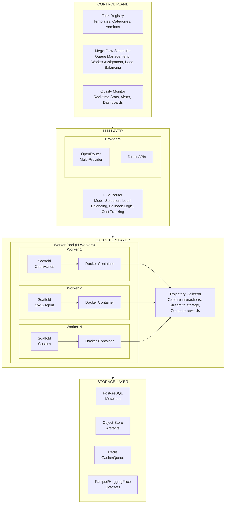
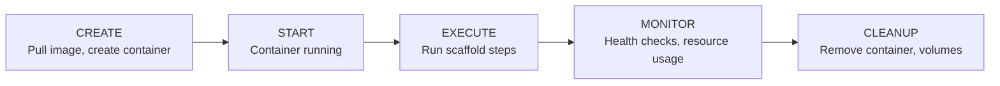
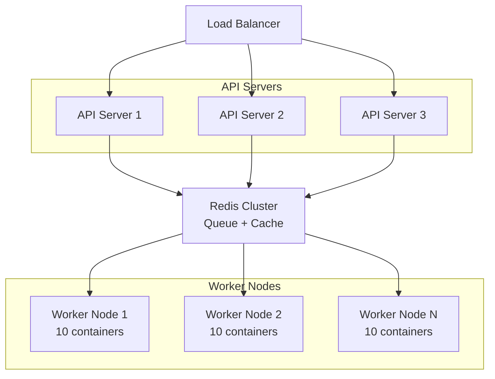

# Architecture Design - Detailed Technical Specification

## 1. High-Level Architecture



---

## 2. Component Specifications

### 2.1 Mega-Flow Scheduler

**Purpose**: Distribute tasks across workers efficiently

```rust
pub struct MegaFlowScheduler {
    task_queue: Arc<Mutex<PriorityQueue<Task>>>,
    worker_pool: WorkerPool,
    metrics: SchedulerMetrics,
    config: SchedulerConfig,
}

pub struct SchedulerConfig {
    max_concurrent_tasks: usize,          // e.g., 100
    task_timeout_seconds: u64,            // e.g., 3600 (1 hour)
    retry_policy: RetryPolicy,
    priority_weights: PriorityWeights,
}

pub struct PriorityWeights {
    difficulty_weight: f32,    // Higher difficulty = higher priority
    category_weight: f32,      // Underrepresented categories = higher priority
    age_weight: f32,           // Older tasks = higher priority
}
```

**Key Functions**:
1. **Task Ingestion**: Accept tasks from API/queue
2. **Priority Calculation**: Score tasks by urgency/importance
3. **Worker Assignment**: Match tasks to available workers
4. **Progress Tracking**: Monitor completion, detect stalls
5. **Retry Handling**: Re-queue failed tasks with backoff

### 2.2 LLM Router

**Purpose**: Route requests to appropriate LLM providers

```rust
pub struct LlmRouter {
    providers: Vec<LlmProvider>,
    routing_strategy: RoutingStrategy,
    cost_tracker: CostTracker,
    fallback_chain: Vec<String>,
}

pub enum RoutingStrategy {
    RoundRobin,                    // Simple rotation
    CostOptimized { budget: f64 }, // Minimize cost
    CapabilityBased {              // Match task to model strengths
        task_type: TaskType,
    },
    LoadBalanced {                 // Distribute evenly
        weights: HashMap<String, f32>,
    },
    Experimental {                 // A/B testing
        experiment_id: String,
        split: f32,
    },
}
```

**Supported Providers**:

| Provider | Models | Cost (per 1M tokens) | Strengths |
|----------|--------|----------------------|-----------|
| OpenRouter | GPT-4, Claude, Gemini | $5-60 | Variety |
| OpenAI | GPT-4-turbo, o1 | $10-60 | Reasoning |
| Anthropic | Claude 3.5 | $3-15 | Long context |
| Google | Gemini Pro | $1.25-5 | Multimodal |
| Local | Qwen, Llama | ~$0 | Privacy/Cost |

### 2.3 Scaffold Runtime

**Purpose**: Provide tool interface between LLM and environment

```rust
pub trait Scaffold: Send + Sync {
    /// Initialize scaffold with container
    async fn initialize(&mut self, container: &DockerContainer) -> Result<()>;
    
    /// Execute a single step
    async fn step(&mut self, llm_output: &str) -> Result<StepResult>;
    
    /// Get available tools
    fn available_tools(&self) -> Vec<ToolSpec>;
    
    /// Get conversation history
    fn get_history(&self) -> Vec<Message>;
    
    /// Check if task is complete
    fn is_terminal(&self) -> bool;
}

pub struct StepResult {
    pub action_taken: Action,
    pub observation: String,
    pub reward: f32,
    pub done: bool,
    pub info: HashMap<String, Value>,
}
```

**Scaffold Implementations**:

| Scaffold | Complexity | Tools | Best For |
|----------|------------|-------|----------|
| MinimalScaffold | Low | bash, edit, read | Simple tasks |
| OpenHands | High | 20+ tools, browser | Complex agents |
| SWEAgent | Medium | file ops, terminal | SWE tasks |
| AiderScaffold | Medium | git, diff, edit | Code changes |

### 2.4 Docker Executor

**Purpose**: Manage container lifecycle for task execution

```rust
pub struct DockerExecutor {
    client: Docker,
    network_manager: NetworkManager,
    volume_manager: VolumeManager,
    resource_limits: ResourceLimits,
}

pub struct ContainerConfig {
    pub image: String,
    pub cmd: Option<Vec<String>>,
    pub env: HashMap<String, String>,
    pub mounts: Vec<Mount>,
    pub network: NetworkMode,
    pub limits: ResourceLimits,
    pub labels: HashMap<String, String>,
}

pub struct ResourceLimits {
    pub memory_mb: u64,       // e.g., 2048
    pub cpu_cores: f32,       // e.g., 1.0
    pub disk_gb: u64,         // e.g., 10
    pub network_mbps: u64,    // e.g., 100
    pub max_processes: u64,   // e.g., 100
}
```

**Container Lifecycle**:



### 2.5 Trajectory Collector

**Purpose**: Capture all data needed for training

```rust
pub struct TrajectoryCollector {
    buffer: Vec<Transition>,
    storage: Box<dyn TrajectoryStorage>,
    reward_calculator: Box<dyn RewardCalculator>,
}

pub struct Transition {
    pub timestamp: DateTime<Utc>,
    pub step_number: u32,
    pub state: State,
    pub action: Action,
    pub observation: Observation,
    pub reward: f32,
    pub done: bool,
    pub info: TransitionInfo,
}

pub struct State {
    pub files: HashMap<PathBuf, FileState>,
    pub working_directory: PathBuf,
    pub environment_variables: HashMap<String, String>,
    pub process_state: ProcessState,
    pub custom_state: Value,
}

pub struct Action {
    pub action_type: ActionType,
    pub content: String,
    pub tool_name: Option<String>,
    pub tool_args: Option<Value>,
    pub reasoning: Option<String>,
}
```

**Reward Calculation**:

| Signal | Weight | Description |
|--------|--------|-------------|
| Test Pass | 0.5 | Passes verification tests |
| Compilation | 0.1 | Code compiles without errors |
| Progress | 0.2 | Makes measurable progress |
| Efficiency | 0.1 | Fewer steps = higher reward |
| Code Quality | 0.1 | Linting, best practices |

---

## 3. Data Models

### 3.1 Task Definition

```rust
pub struct Task {
    // Identity
    pub id: TaskId,
    pub version: Version,
    pub created_at: DateTime<Utc>,
    
    // Content
    pub instruction: String,
    pub category: Category,
    pub difficulty: Difficulty,
    
    // Environment
    pub docker_image: String,
    pub initial_files: HashMap<PathBuf, String>,
    pub environment_vars: HashMap<String, String>,
    pub resource_limits: ResourceLimits,
    
    // Verification
    pub verification_tests: Vec<TestSpec>,
    pub expected_outputs: Option<Vec<String>>,
    pub timeout_seconds: u64,
    
    // Metadata
    pub tags: Vec<String>,
    pub anti_hardcoding: AntiHardcodingConfig,
    pub estimated_steps: Range<u32>,
}
```

### 3.2 Trajectory Record

```rust
pub struct TrajectoryRecord {
    // Identity
    pub trajectory_id: Uuid,
    pub task_id: TaskId,
    pub timestamp: DateTime<Utc>,
    
    // Execution Context
    pub llm_model: String,
    pub scaffold: String,
    pub seed: u64,
    
    // Trajectory Data
    pub transitions: Vec<Transition>,
    pub total_steps: u32,
    pub total_tokens: u64,
    
    // Results
    pub final_result: TaskResult,
    pub total_reward: f32,
    pub execution_time_seconds: f64,
    
    // Quality Metrics
    pub quality_score: f32,
    pub diversity_score: f32,
    pub verification_passed: bool,
}

pub enum TaskResult {
    Success { reward: f32 },
    PartialSuccess { reward: f32, missing: Vec<String> },
    Failure { reason: String },
    Timeout,
    Error { error: String },
}
```

---

## 4. Communication Patterns

### 4.1 Event-Driven Architecture

```rust
pub enum SystemEvent {
    // Task Events
    TaskSubmitted { task_id: TaskId },
    TaskAssigned { task_id: TaskId, worker_id: WorkerId },
    TaskStarted { task_id: TaskId },
    TaskCompleted { task_id: TaskId, result: TaskResult },
    TaskFailed { task_id: TaskId, error: String },
    
    // Trajectory Events
    StepExecuted { task_id: TaskId, step: u32, action: Action },
    TrajectoryStored { trajectory_id: Uuid },
    
    // Worker Events
    WorkerRegistered { worker_id: WorkerId },
    WorkerHealthCheck { worker_id: WorkerId, status: HealthStatus },
    WorkerShutdown { worker_id: WorkerId },
    
    // System Events
    QueueDepthChanged { depth: usize },
    CostThresholdReached { current: f64, threshold: f64 },
}
```

### 4.2 API Endpoints

```
# Task Management
POST   /api/v1/tasks              # Submit new task
GET    /api/v1/tasks/{id}         # Get task status
DELETE /api/v1/tasks/{id}         # Cancel task
GET    /api/v1/tasks              # List tasks (with filters)

# Trajectory Access
GET    /api/v1/trajectories/{id}  # Get trajectory
GET    /api/v1/trajectories       # List trajectories
POST   /api/v1/trajectories/export # Export to HuggingFace

# Worker Management
GET    /api/v1/workers            # List workers
GET    /api/v1/workers/{id}       # Get worker status
POST   /api/v1/workers/{id}/stop  # Stop worker

# Monitoring
GET    /api/v1/metrics            # Prometheus metrics
GET    /api/v1/health             # Health check
GET    /api/v1/stats              # Aggregated statistics
```

---

## 5. Scaling Considerations

### 5.1 Horizontal Scaling



### 5.2 Resource Estimates

| Scale | Workers | Concurrent Tasks | Trajectories/Day | LLM Cost/Day |
|-------|---------|------------------|------------------|--------------|
| Small | 5 | 50 | 500 | $100-500 |
| Medium | 20 | 200 | 2,000 | $400-2,000 |
| Large | 100 | 1,000 | 10,000 | $2,000-10,000 |

---

## 6. Security Considerations

### 6.1 Container Isolation

```rust
pub struct SecurityConfig {
    // Network
    pub network_mode: NetworkMode,        // Isolated by default
    pub allowed_egress: Vec<String>,      // Whitelist for outbound
    
    // Capabilities
    pub drop_capabilities: Vec<String>,   // Drop all unnecessary caps
    pub read_only_root: bool,             // Immutable root filesystem
    
    // Resource
    pub memory_limit: u64,                // Prevent OOM attacks
    pub cpu_limit: f32,                   // Prevent CPU exhaustion
    pub pid_limit: u64,                   // Prevent fork bombs
    
    // Filesystem
    pub no_new_privileges: bool,          // Prevent privilege escalation
    pub seccomp_profile: Option<String>,  // System call filtering
}
```

### 6.2 Secret Management

- **LLM API Keys**: Stored in secret manager (Vault/AWS Secrets)
- **Database Credentials**: Rotated automatically
- **Container Secrets**: Injected at runtime, never in images
- **Audit Logging**: All API access logged

---

## 7. Observability

### 7.1 Metrics (Prometheus)

```
# Task metrics
dataforge_tasks_submitted_total
dataforge_tasks_completed_total
dataforge_tasks_failed_total
dataforge_task_duration_seconds

# Trajectory metrics
dataforge_trajectory_length_steps
dataforge_trajectory_reward_total
dataforge_trajectory_tokens_total

# Worker metrics
dataforge_worker_active_containers
dataforge_worker_cpu_usage_percent
dataforge_worker_memory_usage_bytes

# LLM metrics
dataforge_llm_requests_total
dataforge_llm_tokens_total
dataforge_llm_cost_dollars_total
dataforge_llm_latency_seconds
```

### 7.2 Logging Structure

```json
{
  "timestamp": "2025-02-04T10:30:00Z",
  "level": "INFO",
  "component": "trajectory_collector",
  "task_id": "task-abc123",
  "worker_id": "worker-01",
  "event": "step_executed",
  "data": {
    "step_number": 15,
    "action_type": "execute_command",
    "reward": 0.1,
    "duration_ms": 234
  }
}
```
