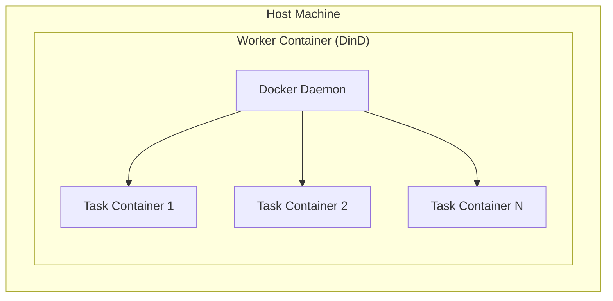
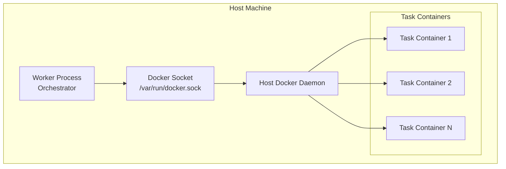
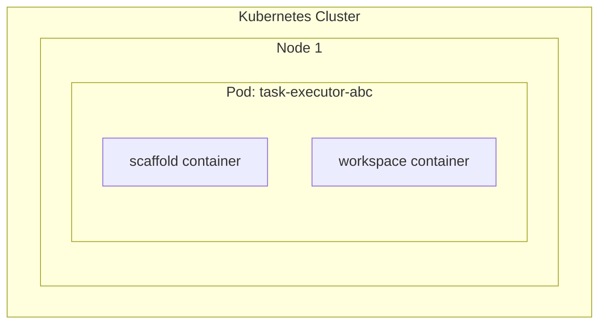
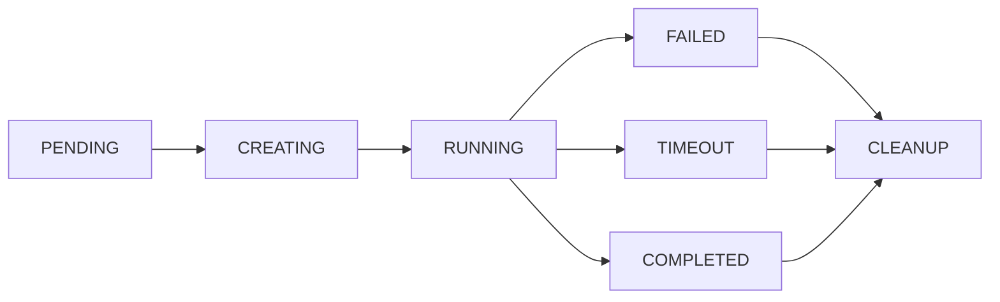

# Docker Infrastructure - Container Orchestration Plan

## 1. Overview

The Docker infrastructure is the execution backbone of the synthetic dataset generation system. Each task runs in an isolated container with controlled resources, network access, and filesystem.

---

## 2. Container Architecture Options

### Option A: Docker-in-Docker (DinD)



**Pros:**
- Complete isolation
- Clean resource limits
- Easy to reason about

**Cons:**
- Performance overhead
- Nested complexity
- Storage layer issues

### Option B: Sibling Containers (Recommended)



**Pros:**
- Better performance
- Simpler architecture
- Direct Docker access

**Cons:**
- Less isolation (shares daemon)
- Requires socket access
- Cleanup responsibility

### Option C: Kubernetes Pods



**Pros:**
- Production-ready scaling
- Built-in orchestration
- Resource quotas

**Cons:**
- Complexity overhead
- Requires K8s expertise
- Higher infrastructure cost

---

## 3. Recommended Architecture Decision

| Factor | Docker Sibling | DinD | Kubernetes |
|--------|---------------|------|------------|
| Simplicity | High | Medium | Low |
| Performance | High | Medium | High |
| Isolation | Medium | High | High |
| Scalability | Medium | Medium | High |
| Development Speed | High | Medium | Low |

**Recommendation**: Start with **Docker Sibling Containers**, migrate to **Kubernetes** when scale requires.

---

## 4. Container Specifications

### 4.1 Base Images

```dockerfile
# Base image for Python tasks
FROM python:3.11-slim AS python-base
RUN apt-get update && apt-get install -y \
    git curl wget vim nano \
    build-essential gcc g++ \
    && rm -rf /var/lib/apt/lists/*
WORKDIR /workspace

# Base image for Node.js tasks
FROM node:20-slim AS node-base
RUN apt-get update && apt-get install -y \
    git curl wget vim \
    && rm -rf /var/lib/apt/lists/*
WORKDIR /workspace

# Base image for Rust tasks
FROM rust:1.75-slim AS rust-base
RUN apt-get update && apt-get install -y \
    git curl wget vim \
    build-essential \
    && rm -rf /var/lib/apt/lists/*
WORKDIR /workspace

# Multi-language base
FROM ubuntu:22.04 AS multi-base
RUN apt-get update && apt-get install -y \
    python3 python3-pip \
    nodejs npm \
    rustc cargo \
    golang-go \
    git curl wget vim \
    build-essential \
    && rm -rf /var/lib/apt/lists/*
WORKDIR /workspace
```

### 4.2 Resource Limits by Difficulty

```rust
pub fn get_resource_limits(difficulty: Difficulty) -> ResourceLimits {
    match difficulty {
        Difficulty::Easy => ResourceLimits {
            memory_mb: 512,
            cpu_cores: 0.5,
            disk_gb: 2,
            max_processes: 50,
            timeout_seconds: 300,    // 5 minutes
        },
        Difficulty::Medium => ResourceLimits {
            memory_mb: 1024,
            cpu_cores: 1.0,
            disk_gb: 5,
            max_processes: 100,
            timeout_seconds: 900,    // 15 minutes
        },
        Difficulty::Hard => ResourceLimits {
            memory_mb: 2048,
            cpu_cores: 2.0,
            disk_gb: 10,
            max_processes: 200,
            timeout_seconds: 1800,   // 30 minutes
        },
        Difficulty::Expert => ResourceLimits {
            memory_mb: 4096,
            cpu_cores: 4.0,
            disk_gb: 20,
            max_processes: 500,
            timeout_seconds: 3600,   // 1 hour
        },
        Difficulty::Nightmare => ResourceLimits {
            memory_mb: 8192,
            cpu_cores: 8.0,
            disk_gb: 50,
            max_processes: 1000,
            timeout_seconds: 7200,   // 2 hours
        },
    }
}
```

### 4.3 Network Policies

```yaml
# Default: Isolated network (no external access)
networks:
  task-network:
    internal: true
    driver: bridge

# Whitelist for specific tasks
networks:
  task-network-with-egress:
    driver: bridge
    ipam:
      config:
        - subnet: 172.28.0.0/16
    # Firewall rules via iptables
    # Only allow: pypi.org, npmjs.com, crates.io
```

**Network Access Levels:**

| Level | External Access | Use Case |
|-------|-----------------|----------|
| `isolated` | None | Security tasks, pure computation |
| `package_only` | Package registries | Standard development |
| `limited_web` | Whitelist domains | API integration tasks |
| `full_web` | Unrestricted (dangerous) | Web scraping tasks |

---

## 5. Container Lifecycle Management

### 5.1 Lifecycle States



### 5.2 Cleanup Policy

```rust
pub struct CleanupPolicy {
    // When to cleanup
    pub cleanup_on_success: bool,        // true
    pub cleanup_on_failure: bool,        // true
    pub cleanup_on_timeout: bool,        // true
    
    // What to preserve
    pub preserve_logs: bool,             // true
    pub preserve_artifacts: bool,        // true
    pub log_retention_days: u32,         // 30
    
    // Cleanup timing
    pub delay_seconds: u64,              // 60 (allow inspection)
    pub force_cleanup_after_hours: u32,  // 24
}
```

---

## 6. Workspace Management

### 6.1 Volume Structure

```
/workspace/                    # Main working directory
├── .swe-forge/                # System files (read-only)
│   ├── task.json              # Task specification
│   ├── tools.json             # Available tools
│   └── config.yaml            # Configuration
├── src/                       # Task files (initialized from template)
│   └── ...
├── tests/                     # Verification tests
│   └── ...
└── output/                    # Agent outputs (writable)
    └── ...
```

### 6.2 Volume Mounts

```rust
pub fn create_mounts(task: &Task) -> Vec<Mount> {
    vec![
        // Task specification (read-only)
        Mount::bind(
            &task.spec_path,
            "/workspace/.swe-forge",
            true, // read_only
        ),
        // Working directory (read-write, ephemeral)
        Mount::tmpfs(
            "/workspace",
            task.resource_limits.disk_gb * 1024 * 1024 * 1024,
        ),
        // Artifact output (persistent)
        Mount::volume(
            &format!("swe-forge-artifacts-{}", task.id),
            "/workspace/output",
            false,
        ),
    ]
}
```

---

## 7. Docker Compose Template

```yaml
version: '3.8'

services:
  task-executor:
    image: ${TASK_IMAGE:-swe-forge/python-base:latest}
    container_name: swe-forge-task-${TASK_ID}
    
    # Resource limits
    deploy:
      resources:
        limits:
          cpus: '${CPU_LIMIT:-1.0}'
          memory: ${MEMORY_LIMIT:-1024M}
        reservations:
          cpus: '${CPU_RESERVATION:-0.5}'
          memory: ${MEMORY_RESERVATION:-512M}
    
    # Security
    security_opt:
      - no-new-privileges:true
      - seccomp:unconfined  # Or custom profile
    cap_drop:
      - ALL
    cap_add:
      - CHOWN
      - SETUID
      - SETGID
    read_only: false  # Need write for workspace
    
    # Network
    networks:
      - task-network
    
    # Volumes
    volumes:
      - task-workspace:/workspace
      - task-artifacts:/workspace/output
      - type: bind
        source: ${TASK_SPEC_PATH}
        target: /workspace/.swe-forge
        read_only: true
    
    # Environment
    environment:
      - TASK_ID=${TASK_ID}
      - DATAFORGE_MODE=execution
      - PYTHONDONTWRITEBYTECODE=1
    
    # Healthcheck
    healthcheck:
      test: ["CMD", "test", "-f", "/workspace/.swe-forge/task.json"]
      interval: 30s
      timeout: 10s
      retries: 3
    
    # Labels for management
    labels:
      swe-forge.task_id: ${TASK_ID}
      swe-forge.created_at: ${CREATED_AT}
      swe-forge.difficulty: ${DIFFICULTY}

networks:
  task-network:
    internal: true
    driver: bridge

volumes:
  task-workspace:
    driver: local
    driver_opts:
      type: tmpfs
      device: tmpfs
      o: size=${WORKSPACE_SIZE:-1g}
  task-artifacts:
    driver: local
```

---

## 8. Questions to Resolve

### Infrastructure Questions

| Question | Options | Recommendation |
|----------|---------|----------------|
| Where to run containers? | Local / Cloud VMs / Kubernetes | Start local, scale to cloud |
| How many concurrent? | 10 / 100 / 1000 | Start with 10, scale based on need |
| Image registry? | Docker Hub / Private / ECR | Private for security |
| Log aggregation? | Local / CloudWatch / Loki | Loki for observability |

### Security Questions

| Question | Options | Risk Level |
|----------|---------|------------|
| Allow network access? | Never / Package registries / Limited | Medium - need for installs |
| Root in container? | Yes / No / Sometimes | Use non-root when possible |
| Seccomp profiles? | Default / Custom / None | Use default at minimum |
| Max container lifetime? | 1hr / 6hr / 24hr | 2hr for most tasks |

### Cost Questions

| Resource | Estimated Cost | Notes |
|----------|---------------|-------|
| Compute (per container-hour) | $0.01-0.10 | Depends on size |
| Storage (per GB-month) | $0.02-0.10 | Ephemeral is cheaper |
| Network egress | $0.01-0.09/GB | Minimize external calls |
| Container registry | $0-50/month | Self-hosted cheaper |

---

## 9. Implementation Phases

### Phase 1: Basic Execution (Week 1-2)
- [ ] Docker API integration in Rust
- [ ] Basic container lifecycle
- [ ] Simple resource limits
- [ ] Local execution only

### Phase 2: Isolation & Security (Week 3-4)
- [ ] Network policies
- [ ] Seccomp profiles
- [ ] Non-root execution
- [ ] Volume management

### Phase 3: Scaling (Week 5-6)
- [ ] Multi-node support
- [ ] Container pooling
- [ ] Health monitoring
- [ ] Auto-cleanup

### Phase 4: Cloud Migration (Week 7-8)
- [ ] Cloud provider integration
- [ ] Kubernetes migration path
- [ ] Cost optimization
- [ ] Production hardening
