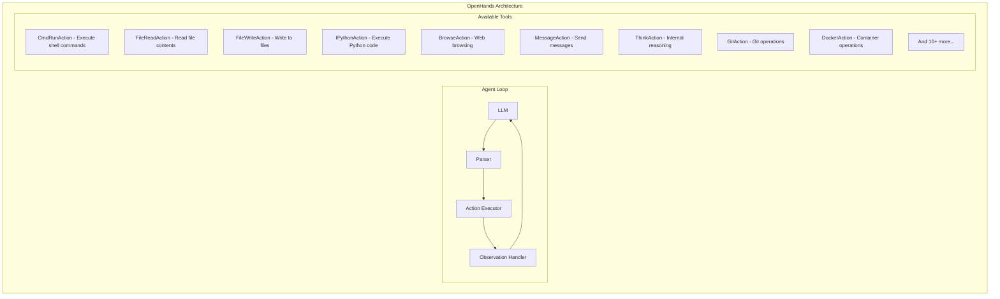
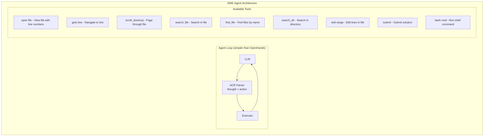
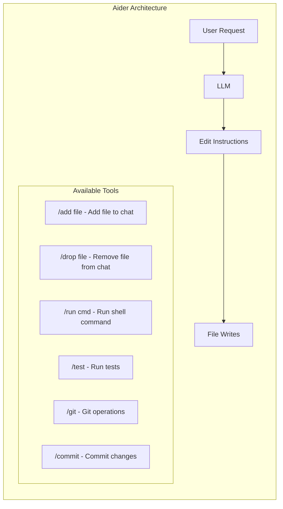

# Scaffold System - Agent Framework Integration

## 1. What is a Scaffold?

A **scaffold** is the runtime framework that:
- Provides tools/actions to the LLM
- Manages conversation history
- Parses and executes LLM outputs
- Handles environment interaction
- Collects trajectory data

Think of it as the "body" that gives the LLM "hands" to interact with the world.

---

## 2. Scaffold Comparison

### 2.1 Available Options

| Scaffold | Complexity | Tools | Language | Active | License |
|----------|------------|-------|----------|--------|---------|
| **OpenHands** | High | 20+ | Python | Yes | Apache 2.0 |
| **SWE-Agent** | Medium | 10+ | Python | Yes | MIT |
| **Aider** | Low | 5 | Python | Yes | Apache 2.0 |
| **Devon** | Medium | 15+ | TypeScript | Yes | AGPL |
| **Custom** | Variable | Custom | Rust | N/A | N/A |

### 2.2 Detailed Comparison

#### OpenHands (formerly OpenDevin)



**Pros:**
- Most comprehensive tool set
- Active development, large community
- Web browsing capability
- Good documentation
- Evaluation benchmarks included

**Cons:**
- Complex setup (Docker, frontend, backend)
- Heavy resource usage
- Python-based (integration overhead with Rust)
- Opinionated agent architecture

#### SWE-Agent



**Pros:**
- Designed for SWE tasks specifically
- Simpler architecture
- Well-tested on SWE-Bench
- Efficient token usage

**Cons:**
- Limited to coding tasks
- No web browsing
- Smaller tool set
- Less flexible

#### Aider



**Pros:**
- Simple and focused
- Excellent for code changes
- Git integration
- Lightweight

**Cons:**
- Very limited scope
- Not suitable for complex tasks
- Less trajectory data

---

## 3. Scaffold Selection Decision Matrix

### 3.1 Decision Criteria

| Criterion | Weight | OpenHands | SWE-Agent | Aider | Custom |
|-----------|--------|-----------|-----------|-------|--------|
| Tool richness | 25% | 10 | 7 | 4 | Variable |
| SWE task fit | 25% | 8 | 10 | 6 | 8 |
| Integration ease | 20% | 5 | 7 | 8 | 10 |
| Trajectory quality | 15% | 9 | 8 | 6 | 9 |
| Maintenance burden | 15% | 4 | 6 | 8 | 3 |
| **Weighted Score** | | **7.35** | **7.65** | **6.1** | **7.8** |

### 3.2 Recommendation

**Primary**: Implement a **Custom Minimal Scaffold** in Rust for:
- Native integration
- Full trajectory control
- Performance

**Secondary**: Integrate **SWE-Agent** via subprocess for:
- Complex SWE tasks
- Benchmark compatibility
- Community-tested prompts

**Optional**: Add **OpenHands** for:
- Web tasks
- Maximum tool variety
- Research comparisons

---

## 4. Custom Scaffold Design

### 4.1 Architecture

```rust
pub struct DataforgeScaffold {
    container: DockerContainer,
    tools: Vec<Box<dyn Tool>>,
    history: ConversationHistory,
    state: EnvironmentState,
    trajectory: TrajectoryBuffer,
}

#[async_trait]
pub trait Tool: Send + Sync {
    fn name(&self) -> &str;
    fn description(&self) -> &str;
    fn parameters(&self) -> &ToolParameters;
    async fn execute(&self, args: &Value, ctx: &ExecutionContext) -> Result<ToolResult>;
}

pub struct ToolResult {
    pub success: bool,
    pub output: String,
    pub state_changes: Vec<StateChange>,
    pub partial_reward: f32,
}
```

### 4.2 Core Tools

| Tool | Description | Parameters |
|------|-------------|------------|
| `bash` | Execute shell command | `command: string` |
| `read_file` | Read file contents | `path: string, start_line?: int, end_line?: int` |
| `write_file` | Write/create file | `path: string, content: string` |
| `edit_file` | Edit existing file | `path: string, old: string, new: string` |
| `search` | Search in files | `pattern: string, path?: string, type?: regex\|literal` |
| `list_files` | List directory | `path: string, recursive?: bool` |
| `run_tests` | Execute tests | `path?: string, filter?: string` |
| `think` | Internal reasoning | `thought: string` |
| `submit` | Mark task complete | `answer?: string` |

### 4.3 Tool Definitions (JSON Schema)

```json
{
  "tools": [
    {
      "name": "bash",
      "description": "Execute a shell command in the container",
      "parameters": {
        "type": "object",
        "properties": {
          "command": {
            "type": "string",
            "description": "The shell command to execute"
          },
          "timeout_seconds": {
            "type": "integer",
            "default": 30,
            "description": "Maximum execution time"
          }
        },
        "required": ["command"]
      }
    },
    {
      "name": "read_file",
      "description": "Read contents of a file",
      "parameters": {
        "type": "object",
        "properties": {
          "path": {
            "type": "string",
            "description": "Path to the file to read"
          },
          "start_line": {
            "type": "integer",
            "description": "Start line (1-indexed, optional)"
          },
          "end_line": {
            "type": "integer", 
            "description": "End line (1-indexed, optional)"
          }
        },
        "required": ["path"]
      }
    },
    {
      "name": "edit_file",
      "description": "Edit a file by replacing text",
      "parameters": {
        "type": "object",
        "properties": {
          "path": {
            "type": "string",
            "description": "Path to the file to edit"
          },
          "old_content": {
            "type": "string",
            "description": "Exact text to find and replace"
          },
          "new_content": {
            "type": "string",
            "description": "Replacement text"
          }
        },
        "required": ["path", "old_content", "new_content"]
      }
    }
  ]
}
```

### 4.4 Agent Loop Implementation

```rust
impl DataforgeScaffold {
    pub async fn run(&mut self, task: &Task) -> Result<Trajectory> {
        // Initialize
        self.setup_environment(task).await?;
        self.trajectory.start(task);
        
        let mut step = 0;
        let max_steps = task.max_steps.unwrap_or(100);
        
        while step < max_steps {
            // Capture state
            let state = self.capture_state().await?;
            self.trajectory.record_state(step, &state);
            
            // Get LLM action
            let prompt = self.build_prompt(&state, task);
            let response = self.llm.chat(prompt).await?;
            
            // Parse action
            let action = self.parse_action(&response)?;
            self.trajectory.record_action(step, &action);
            
            // Execute action
            let observation = self.execute_action(&action).await?;
            self.trajectory.record_observation(step, &observation);
            
            // Calculate reward
            let reward = self.calculate_reward(&state, &action, &observation, task)?;
            self.trajectory.record_reward(step, reward);
            
            // Check termination
            if self.is_terminal(&action, &observation, task) {
                break;
            }
            
            step += 1;
        }
        
        // Finalize trajectory
        let final_result = self.verify_task(task).await?;
        self.trajectory.finalize(final_result);
        
        Ok(self.trajectory.export())
    }
}
```

---

## 5. External Scaffold Integration

### 5.1 SWE-Agent Integration

```rust
pub struct SweAgentBridge {
    python_path: PathBuf,
    swe_agent_path: PathBuf,
    config: SweAgentConfig,
}

impl Scaffold for SweAgentBridge {
    async fn initialize(&mut self, container: &DockerContainer) -> Result<()> {
        // Setup SWE-Agent config
        let config = self.generate_config(container)?;
        
        // Start SWE-Agent subprocess
        self.process = Command::new(&self.python_path)
            .arg("-m")
            .arg("sweagent")
            .arg("--config")
            .arg(&config)
            .stdin(Stdio::piped())
            .stdout(Stdio::piped())
            .spawn()?;
            
        Ok(())
    }
    
    async fn step(&mut self, llm_output: &str) -> Result<StepResult> {
        // Parse SWE-Agent output format
        // Execute in container
        // Return structured result
    }
}
```

### 5.2 OpenHands Integration

```rust
pub struct OpenHandsBridge {
    server_url: String,
    session_id: String,
}

impl Scaffold for OpenHandsBridge {
    async fn initialize(&mut self, container: &DockerContainer) -> Result<()> {
        // Start OpenHands server (Docker)
        // Create session
        // Configure workspace
    }
    
    async fn step(&mut self, llm_output: &str) -> Result<StepResult> {
        // Send action via HTTP API
        // Poll for completion
        // Return observation
    }
}
```

---

## 6. Scaffold Diversity Strategy

### 6.1 Why Multiple Scaffolds?

| Reason | Benefit |
|--------|---------|
| **Trajectory Diversity** | Different tools = different solutions |
| **Benchmark Coverage** | Match scaffold to benchmark requirements |
| **Research** | Compare scaffold effectiveness |
| **Specialization** | Best scaffold for task type |

### 6.2 Scaffold Selection per Task

```rust
pub fn select_scaffold(task: &Task) -> ScaffoldType {
    match task.category {
        Category::WebDevelopment => ScaffoldType::OpenHands,
        Category::Debugging => ScaffoldType::SweAgent,
        Category::Refactoring => ScaffoldType::SweAgent,
        Category::DataScience => ScaffoldType::OpenHands,
        Category::DevOps => ScaffoldType::Custom,
        Category::Security => ScaffoldType::Custom,
        _ => ScaffoldType::Custom,
    }
}
```

---

## 7. Questions to Resolve

### Implementation Questions

| Question | Options | Trade-off |
|----------|---------|-----------|
| Primary scaffold? | Custom / SWE-Agent / OpenHands | Control vs features |
| How many scaffolds? | 1 / 2-3 / All | Simplicity vs diversity |
| Integration method? | Subprocess / HTTP API / Native | Performance vs maintainability |

### Tool Design Questions

| Question | Options | Consideration |
|----------|---------|---------------|
| Tool granularity? | Fine (many tools) / Coarse (few tools) | Token efficiency |
| Include web browsing? | Yes / No | Scope creep vs capability |
| Allow arbitrary code? | Yes / Sandboxed / No | Security vs flexibility |

### Data Quality Questions

| Question | Why It Matters |
|----------|----------------|
| Which scaffold produces best trajectories? | Training data quality |
| Does scaffold affect task success rate? | Data completeness |
| Optimal tool set per category? | Efficiency |

---

## 8. Implementation Phases

### Phase 1: Custom Scaffold (Week 1-2)
- [ ] Core tool implementations
- [ ] Agent loop
- [ ] Trajectory collection
- [ ] Docker integration

### Phase 2: SWE-Agent Bridge (Week 3)
- [ ] Process management
- [ ] Config generation
- [ ] Output parsing
- [ ] Error handling

### Phase 3: OpenHands Bridge (Week 4)
- [ ] Docker setup
- [ ] API client
- [ ] Session management
- [ ] Web tool integration

### Phase 4: Scaffold Orchestration (Week 5)
- [ ] Selection logic
- [ ] Unified interface
- [ ] Metrics collection
- [ ] A/B testing support
