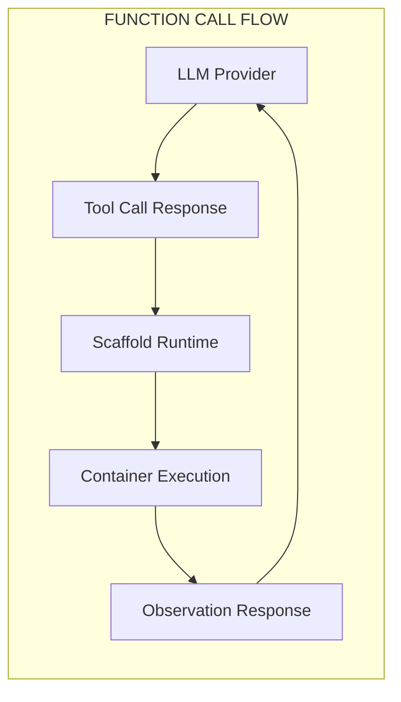
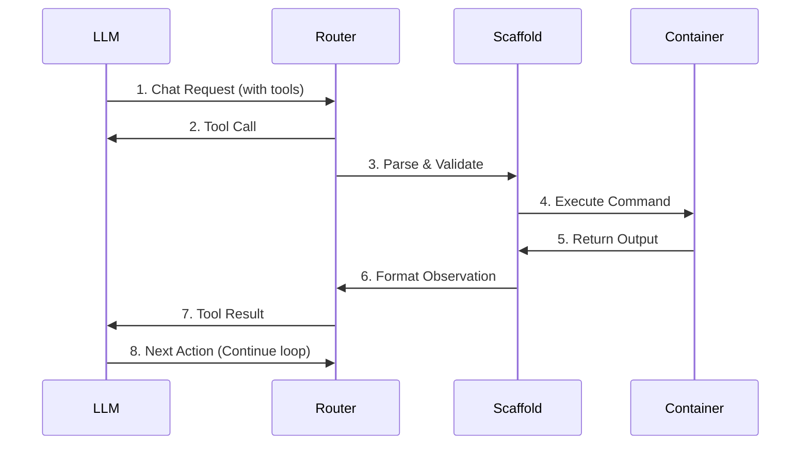
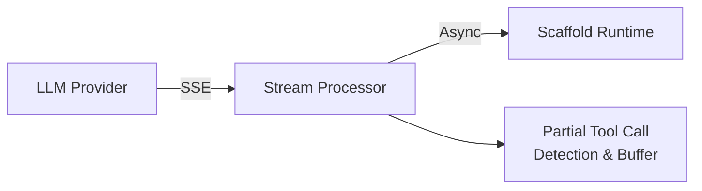

# Function Calls & Tool Calling - Agent Runtime Specification

## 1. Overview

**Function Calling** (also known as **Tool Calling**) is the mechanism by which LLMs communicate actionable intent to agent runtimes. This document specifies how the Synthetic Dataset Generation System implements function calling to enable agents to execute tasks autonomously.

---

## 2. Function Call Architecture

### 2.1 High-Level Flow



### 2.2 Detailed Sequence



---

## 3. Tool Definition Schemas

### 3.1 JSON Schema Format (Standard)

All tools are defined using JSON Schema to ensure compatibility across LLM providers:

```json
{
  "name": "tool_name",
  "description": "Detailed description of what the tool does",
  "parameters": {
    "type": "object",
    "properties": {
      "param1": {
        "type": "string",
        "description": "Description of parameter 1"
      },
      "param2": {
        "type": "integer",
        "description": "Description of parameter 2",
        "default": 10
      }
    },
    "required": ["param1"],
    "additionalProperties": false
  }
}
```

### 3.2 Core Tool Definitions

#### 3.2.1 Bash Execution Tool

```json
{
  "name": "bash",
  "description": "Execute a shell command in the container environment. Returns stdout, stderr, and exit code.",
  "parameters": {
    "type": "object",
    "properties": {
      "command": {
        "type": "string",
        "description": "The shell command to execute"
      },
      "working_directory": {
        "type": "string",
        "description": "Directory to execute the command in (default: current working directory)"
      },
      "timeout_seconds": {
        "type": "integer",
        "description": "Maximum execution time in seconds",
        "default": 30,
        "minimum": 1,
        "maximum": 300
      },
      "env": {
        "type": "object",
        "description": "Additional environment variables to set",
        "additionalProperties": {
          "type": "string"
        }
      }
    },
    "required": ["command"],
    "additionalProperties": false
  }
}
```

#### 3.2.2 File Read Tool

```json
{
  "name": "read_file",
  "description": "Read the contents of a file. Supports reading entire files or specific line ranges.",
  "parameters": {
    "type": "object",
    "properties": {
      "path": {
        "type": "string",
        "description": "Absolute or relative path to the file"
      },
      "start_line": {
        "type": "integer",
        "description": "Start line number (1-indexed, inclusive)",
        "minimum": 1
      },
      "end_line": {
        "type": "integer",
        "description": "End line number (1-indexed, inclusive)",
        "minimum": 1
      },
      "encoding": {
        "type": "string",
        "description": "File encoding",
        "default": "utf-8",
        "enum": ["utf-8", "ascii", "latin-1", "utf-16"]
      }
    },
    "required": ["path"],
    "additionalProperties": false
  }
}
```

#### 3.2.3 File Write Tool

```json
{
  "name": "write_file",
  "description": "Write content to a file. Creates the file if it doesn't exist, overwrites if it does.",
  "parameters": {
    "type": "object",
    "properties": {
      "path": {
        "type": "string",
        "description": "Absolute or relative path to the file"
      },
      "content": {
        "type": "string",
        "description": "Content to write to the file"
      },
      "create_directories": {
        "type": "boolean",
        "description": "Create parent directories if they don't exist",
        "default": true
      },
      "mode": {
        "type": "string",
        "description": "Write mode: 'overwrite' or 'append'",
        "default": "overwrite",
        "enum": ["overwrite", "append"]
      }
    },
    "required": ["path", "content"],
    "additionalProperties": false
  }
}
```

#### 3.2.4 File Edit Tool

```json
{
  "name": "edit_file",
  "description": "Edit a file by finding and replacing specific text. The old_content must match exactly.",
  "parameters": {
    "type": "object",
    "properties": {
      "path": {
        "type": "string",
        "description": "Path to the file to edit"
      },
      "old_content": {
        "type": "string",
        "description": "Exact text to find and replace (must be unique in file)"
      },
      "new_content": {
        "type": "string",
        "description": "Text to replace old_content with"
      },
      "occurrence": {
        "type": "string",
        "description": "Which occurrence to replace: 'first', 'last', or 'all'",
        "default": "first",
        "enum": ["first", "last", "all"]
      }
    },
    "required": ["path", "old_content", "new_content"],
    "additionalProperties": false
  }
}
```

#### 3.2.5 Search Tool

```json
{
  "name": "search",
  "description": "Search for text patterns in files. Supports regex and literal matching.",
  "parameters": {
    "type": "object",
    "properties": {
      "pattern": {
        "type": "string",
        "description": "Search pattern (regex or literal string)"
      },
      "path": {
        "type": "string",
        "description": "File or directory path to search in",
        "default": "."
      },
      "type": {
        "type": "string",
        "description": "Pattern type: 'regex' or 'literal'",
        "default": "literal",
        "enum": ["regex", "literal"]
      },
      "case_sensitive": {
        "type": "boolean",
        "description": "Enable case-sensitive matching",
        "default": true
      },
      "include_pattern": {
        "type": "string",
        "description": "Glob pattern for files to include (e.g., '*.py')"
      },
      "exclude_pattern": {
        "type": "string",
        "description": "Glob pattern for files to exclude (e.g., 'node_modules/**')"
      },
      "max_results": {
        "type": "integer",
        "description": "Maximum number of results to return",
        "default": 50,
        "minimum": 1,
        "maximum": 1000
      },
      "context_lines": {
        "type": "integer",
        "description": "Number of context lines before and after match",
        "default": 2,
        "minimum": 0,
        "maximum": 10
      }
    },
    "required": ["pattern"],
    "additionalProperties": false
  }
}
```

#### 3.2.6 List Files Tool

```json
{
  "name": "list_files",
  "description": "List files and directories in a path.",
  "parameters": {
    "type": "object",
    "properties": {
      "path": {
        "type": "string",
        "description": "Directory path to list",
        "default": "."
      },
      "recursive": {
        "type": "boolean",
        "description": "List files recursively",
        "default": false
      },
      "include_hidden": {
        "type": "boolean",
        "description": "Include hidden files (starting with .)",
        "default": false
      },
      "pattern": {
        "type": "string",
        "description": "Glob pattern to filter results"
      },
      "max_depth": {
        "type": "integer",
        "description": "Maximum recursion depth (only if recursive=true)",
        "default": 10,
        "minimum": 1
      }
    },
    "required": [],
    "additionalProperties": false
  }
}
```

#### 3.2.7 Think Tool

```json
{
  "name": "think",
  "description": "Record internal reasoning or planning. Does not execute any action, used for chain-of-thought.",
  "parameters": {
    "type": "object",
    "properties": {
      "thought": {
        "type": "string",
        "description": "The reasoning or planning text to record"
      }
    },
    "required": ["thought"],
    "additionalProperties": false
  }
}
```

#### 3.2.8 Submit Tool

```json
{
  "name": "submit",
  "description": "Mark the task as complete and submit the final answer. This terminates the agent loop.",
  "parameters": {
    "type": "object",
    "properties": {
      "answer": {
        "type": "string",
        "description": "Final answer or summary of work done"
      },
      "confidence": {
        "type": "number",
        "description": "Confidence score (0.0 to 1.0)",
        "minimum": 0.0,
        "maximum": 1.0
      }
    },
    "required": [],
    "additionalProperties": false
  }
}
```

### 3.3 Rust Tool Trait Definition

```rust
use async_trait::async_trait;
use serde::{Deserialize, Serialize};
use serde_json::Value;

/// JSON Schema representation for tool parameters
#[derive(Debug, Clone, Serialize, Deserialize)]
pub struct ToolSchema {
    pub name: String,
    pub description: String,
    pub parameters: ParameterSchema,
}

#[derive(Debug, Clone, Serialize, Deserialize)]
pub struct ParameterSchema {
    #[serde(rename = "type")]
    pub schema_type: String,
    pub properties: std::collections::HashMap<String, PropertySchema>,
    pub required: Vec<String>,
    #[serde(default)]
    pub additional_properties: bool,
}

#[derive(Debug, Clone, Serialize, Deserialize)]
pub struct PropertySchema {
    #[serde(rename = "type")]
    pub prop_type: String,
    pub description: String,
    #[serde(skip_serializing_if = "Option::is_none")]
    pub default: Option<Value>,
    #[serde(rename = "enum", skip_serializing_if = "Option::is_none")]
    pub enum_values: Option<Vec<String>>,
    #[serde(skip_serializing_if = "Option::is_none")]
    pub minimum: Option<i64>,
    #[serde(skip_serializing_if = "Option::is_none")]
    pub maximum: Option<i64>,
}

/// Result from tool execution
#[derive(Debug, Clone, Serialize, Deserialize)]
pub struct ToolResult {
    pub success: bool,
    pub output: String,
    pub error: Option<String>,
    pub exit_code: Option<i32>,
    pub execution_time_ms: u64,
    pub state_changes: Vec<StateChange>,
}

#[derive(Debug, Clone, Serialize, Deserialize)]
pub enum StateChange {
    FileCreated(String),
    FileModified(String),
    FileDeleted(String),
    DirectoryCreated(String),
    ProcessStarted { pid: u32, command: String },
    ProcessTerminated { pid: u32, exit_code: i32 },
    EnvVarSet { key: String, value: String },
}

/// Execution context provided to tools
pub struct ExecutionContext {
    pub container_id: String,
    pub working_directory: std::path::PathBuf,
    pub environment: std::collections::HashMap<String, String>,
    pub timeout: std::time::Duration,
}

/// The core trait that all tools must implement
#[async_trait]
pub trait Tool: Send + Sync {
    /// Returns the tool's JSON schema definition
    fn schema(&self) -> ToolSchema;
    
    /// Validates the provided arguments against the schema
    fn validate_args(&self, args: &Value) -> Result<(), ValidationError>;
    
    /// Executes the tool with the given arguments
    async fn execute(
        &self,
        args: &Value,
        ctx: &ExecutionContext,
    ) -> Result<ToolResult, ToolError>;
    
    /// Returns whether this tool is a terminal action
    fn is_terminal(&self) -> bool {
        false
    }
}

#[derive(Debug, thiserror::Error)]
pub enum ValidationError {
    #[error("Missing required parameter: {0}")]
    MissingRequired(String),
    #[error("Invalid parameter type for {0}: expected {1}")]
    InvalidType(String, String),
    #[error("Parameter {0} out of range: {1}")]
    OutOfRange(String, String),
    #[error("Unknown parameter: {0}")]
    UnknownParameter(String),
}

#[derive(Debug, thiserror::Error)]
pub enum ToolError {
    #[error("Validation error: {0}")]
    Validation(#[from] ValidationError),
    #[error("Execution error: {0}")]
    Execution(String),
    #[error("Timeout after {0:?}")]
    Timeout(std::time::Duration),
    #[error("Permission denied: {0}")]
    PermissionDenied(String),
    #[error("Resource not found: {0}")]
    NotFound(String),
}
```

---

## 4. LLM Provider Function Call Support

### 4.1 Provider Compatibility Matrix

| Provider | Function Calling | Parallel Calls | Streaming | JSON Mode | Tool Choice |
|----------|------------------|----------------|-----------|-----------|-------------|
| **OpenAI** (GPT-4) | Native | Yes | Yes | Yes | Yes |
| **Anthropic** (Claude) | Native | Yes | Yes | Via system | Yes |
| **Google** (Gemini) | Native | Yes | Yes | Yes | Yes |
| **OpenRouter** | Proxy | Depends | Yes | Depends | Depends |
| **Local** (Ollama) | Limited | No | Yes | Limited | No |
| **Local** (vLLM) | OpenAI-compat | Yes | Yes | Yes | Yes |

### 4.2 OpenAI Function Call Format

**Request Format:**

```json
{
  "model": "gpt-4-turbo",
  "messages": [
    {
      "role": "system",
      "content": "You are a coding assistant..."
    },
    {
      "role": "user",
      "content": "Read the main.py file"
    }
  ],
  "tools": [
    {
      "type": "function",
      "function": {
        "name": "read_file",
        "description": "Read the contents of a file",
        "parameters": {
          "type": "object",
          "properties": {
            "path": {
              "type": "string",
              "description": "Path to the file"
            }
          },
          "required": ["path"]
        }
      }
    }
  ],
  "tool_choice": "auto"
}
```

**Response Format (Tool Call):**

```json
{
  "id": "chatcmpl-abc123",
  "object": "chat.completion",
  "model": "gpt-4-turbo",
  "choices": [
    {
      "index": 0,
      "message": {
        "role": "assistant",
        "content": null,
        "tool_calls": [
          {
            "id": "call_abc123",
            "type": "function",
            "function": {
              "name": "read_file",
              "arguments": "{\"path\": \"main.py\"}"
            }
          }
        ]
      },
      "finish_reason": "tool_calls"
    }
  ],
  "usage": {
    "prompt_tokens": 150,
    "completion_tokens": 25,
    "total_tokens": 175
  }
}
```

**Tool Result Message:**

```json
{
  "role": "tool",
  "tool_call_id": "call_abc123",
  "content": "def main():\n    print('Hello, World!')\n\nif __name__ == '__main__':\n    main()"
}
```

### 4.3 Anthropic (Claude) Function Call Format

**Request Format:**

```json
{
  "model": "claude-3-5-sonnet-20241022",
  "max_tokens": 4096,
  "system": "You are a coding assistant...",
  "messages": [
    {
      "role": "user",
      "content": "Read the main.py file"
    }
  ],
  "tools": [
    {
      "name": "read_file",
      "description": "Read the contents of a file",
      "input_schema": {
        "type": "object",
        "properties": {
          "path": {
            "type": "string",
            "description": "Path to the file"
          }
        },
        "required": ["path"]
      }
    }
  ],
  "tool_choice": {"type": "auto"}
}
```

**Response Format (Tool Use):**

```json
{
  "id": "msg_abc123",
  "type": "message",
  "role": "assistant",
  "content": [
    {
      "type": "tool_use",
      "id": "toolu_abc123",
      "name": "read_file",
      "input": {
        "path": "main.py"
      }
    }
  ],
  "stop_reason": "tool_use",
  "usage": {
    "input_tokens": 150,
    "output_tokens": 30
  }
}
```

**Tool Result Message:**

```json
{
  "role": "user",
  "content": [
    {
      "type": "tool_result",
      "tool_use_id": "toolu_abc123",
      "content": "def main():\n    print('Hello, World!')\n\nif __name__ == '__main__':\n    main()"
    }
  ]
}
```

### 4.4 Google (Gemini) Function Call Format

**Request Format:**

```json
{
  "contents": [
    {
      "role": "user",
      "parts": [{"text": "Read the main.py file"}]
    }
  ],
  "tools": [
    {
      "function_declarations": [
        {
          "name": "read_file",
          "description": "Read the contents of a file",
          "parameters": {
            "type": "object",
            "properties": {
              "path": {
                "type": "string",
                "description": "Path to the file"
              }
            },
            "required": ["path"]
          }
        }
      ]
    }
  ],
  "tool_config": {
    "function_calling_config": {
      "mode": "AUTO"
    }
  }
}
```

**Response Format:**

```json
{
  "candidates": [
    {
      "content": {
        "role": "model",
        "parts": [
          {
            "functionCall": {
              "name": "read_file",
              "args": {
                "path": "main.py"
              }
            }
          }
        ]
      },
      "finishReason": "STOP"
    }
  ],
  "usageMetadata": {
    "promptTokenCount": 150,
    "candidatesTokenCount": 25,
    "totalTokenCount": 175
  }
}
```

### 4.5 Unified Provider Interface

```rust
use async_trait::async_trait;
use serde::{Deserialize, Serialize};

/// Unified tool call representation (provider-agnostic)
#[derive(Debug, Clone, Serialize, Deserialize)]
pub struct ToolCall {
    pub id: String,
    pub name: String,
    pub arguments: serde_json::Value,
}

/// Unified chat request with tools
#[derive(Debug, Clone, Serialize, Deserialize)]
pub struct ChatRequest {
    pub model: String,
    pub messages: Vec<Message>,
    pub tools: Vec<ToolSchema>,
    pub tool_choice: ToolChoice,
    pub temperature: Option<f32>,
    pub max_tokens: Option<usize>,
}

#[derive(Debug, Clone, Serialize, Deserialize)]
pub enum ToolChoice {
    Auto,
    None,
    Required,
    Specific(String), // Force use of specific tool
}

/// Unified chat response
#[derive(Debug, Clone, Serialize, Deserialize)]
pub struct ChatResponse {
    pub id: String,
    pub content: Option<String>,
    pub tool_calls: Vec<ToolCall>,
    pub finish_reason: FinishReason,
    pub usage: TokenUsage,
}

#[derive(Debug, Clone, Serialize, Deserialize)]
pub enum FinishReason {
    Stop,
    ToolCalls,
    Length,
    ContentFilter,
    Error,
}

/// Provider trait for unified LLM access
#[async_trait]
pub trait LlmProvider: Send + Sync {
    /// Send a chat completion request with tool support
    async fn chat(&self, request: ChatRequest) -> Result<ChatResponse, LlmError>;
    
    /// Stream a chat completion response
    async fn chat_stream(
        &self,
        request: ChatRequest,
    ) -> Result<impl futures::Stream<Item = Result<ChatChunk, LlmError>>, LlmError>;
    
    /// Check if provider supports function calling
    fn supports_tools(&self) -> bool;
    
    /// Check if provider supports parallel tool calls
    fn supports_parallel_tools(&self) -> bool;
    
    /// Convert internal tool schema to provider-specific format
    fn format_tools(&self, tools: &[ToolSchema]) -> serde_json::Value;
    
    /// Parse provider-specific response into unified format
    fn parse_response(&self, raw: serde_json::Value) -> Result<ChatResponse, LlmError>;
}
```

---

## 5. Agent Runtime Integration

### 5.1 Scaffold-to-LLM Tool Exposure

The scaffold system exposes tools to LLMs through a standardized interface:

```rust
pub struct AgentRuntime {
    llm: Box<dyn LlmProvider>,
    tools: Vec<Box<dyn Tool>>,
    history: ConversationHistory,
    config: RuntimeConfig,
}

impl AgentRuntime {
    /// Build tool schemas for LLM request
    pub fn build_tool_schemas(&self) -> Vec<ToolSchema> {
        self.tools.iter().map(|t| t.schema()).collect()
    }
    
    /// Execute a single agent step
    pub async fn step(&mut self) -> Result<StepResult, RuntimeError> {
        // 1. Build request with current history and tools
        let request = ChatRequest {
            model: self.config.model.clone(),
            messages: self.history.messages(),
            tools: self.build_tool_schemas(),
            tool_choice: ToolChoice::Auto,
            temperature: Some(self.config.temperature),
            max_tokens: Some(self.config.max_tokens),
        };
        
        // 2. Get LLM response
        let response = self.llm.chat(request).await?;
        
        // 3. Process response
        match response.finish_reason {
            FinishReason::ToolCalls => {
                let results = self.execute_tool_calls(&response.tool_calls).await?;
                self.history.add_tool_calls(&response.tool_calls, &results);
                Ok(StepResult::Continue { tool_results: results })
            }
            FinishReason::Stop => {
                self.history.add_assistant_message(&response.content.unwrap_or_default());
                Ok(StepResult::Complete { 
                    message: response.content 
                })
            }
            _ => Err(RuntimeError::UnexpectedFinish(response.finish_reason)),
        }
    }
    
    /// Execute multiple tool calls (potentially in parallel)
    async fn execute_tool_calls(
        &self,
        tool_calls: &[ToolCall],
    ) -> Result<Vec<ToolResult>, RuntimeError> {
        let mut results = Vec::new();
        
        for call in tool_calls {
            let tool = self.find_tool(&call.name)?;
            let ctx = self.build_execution_context();
            
            // Validate arguments
            tool.validate_args(&call.arguments)?;
            
            // Execute tool
            let result = tool.execute(&call.arguments, &ctx).await?;
            results.push(result);
            
            // Check for terminal action
            if tool.is_terminal() {
                break;
            }
        }
        
        Ok(results)
    }
    
    fn find_tool(&self, name: &str) -> Result<&Box<dyn Tool>, RuntimeError> {
        self.tools
            .iter()
            .find(|t| t.schema().name == name)
            .ok_or(RuntimeError::UnknownTool(name.to_string()))
    }
}
```

### 5.2 Conversation History Management

```rust
pub struct ConversationHistory {
    messages: Vec<Message>,
    max_tokens: usize,
    truncation_strategy: TruncationStrategy,
}

#[derive(Debug, Clone, Serialize, Deserialize)]
pub struct Message {
    pub role: Role,
    pub content: MessageContent,
}

#[derive(Debug, Clone, Serialize, Deserialize)]
pub enum Role {
    System,
    User,
    Assistant,
    Tool,
}

#[derive(Debug, Clone, Serialize, Deserialize)]
#[serde(untagged)]
pub enum MessageContent {
    Text(String),
    ToolCalls(Vec<ToolCall>),
    ToolResult {
        tool_call_id: String,
        output: String,
    },
}

impl ConversationHistory {
    /// Add tool calls and their results to history
    pub fn add_tool_calls(&mut self, calls: &[ToolCall], results: &[ToolResult]) {
        // Add assistant message with tool calls
        self.messages.push(Message {
            role: Role::Assistant,
            content: MessageContent::ToolCalls(calls.to_vec()),
        });
        
        // Add tool results
        for (call, result) in calls.iter().zip(results.iter()) {
            self.messages.push(Message {
                role: Role::Tool,
                content: MessageContent::ToolResult {
                    tool_call_id: call.id.clone(),
                    output: format_tool_output(result),
                },
            });
        }
        
        // Apply truncation if needed
        self.truncate_if_needed();
    }
    
    fn truncate_if_needed(&mut self) {
        let current_tokens = self.estimate_tokens();
        if current_tokens > self.max_tokens {
            match self.truncation_strategy {
                TruncationStrategy::DropOldest => self.drop_oldest_messages(),
                TruncationStrategy::Summarize => self.summarize_history(),
                TruncationStrategy::SlidingWindow => self.apply_sliding_window(),
            }
        }
    }
}
```

### 5.3 Tool Registration and Discovery

```rust
pub struct ToolRegistry {
    tools: std::collections::HashMap<String, Box<dyn Tool>>,
    categories: std::collections::HashMap<String, Vec<String>>,
}

impl ToolRegistry {
    pub fn new() -> Self {
        Self {
            tools: std::collections::HashMap::new(),
            categories: std::collections::HashMap::new(),
        }
    }
    
    /// Register a tool with the registry
    pub fn register<T: Tool + 'static>(&mut self, tool: T) -> &mut Self {
        let schema = tool.schema();
        self.tools.insert(schema.name.clone(), Box::new(tool));
        self
    }
    
    /// Register a tool under a category
    pub fn register_in_category<T: Tool + 'static>(
        &mut self, 
        tool: T, 
        category: &str
    ) -> &mut Self {
        let schema = tool.schema();
        let name = schema.name.clone();
        self.tools.insert(name.clone(), Box::new(tool));
        self.categories
            .entry(category.to_string())
            .or_insert_with(Vec::new)
            .push(name);
        self
    }
    
    /// Get tools by category
    pub fn get_category(&self, category: &str) -> Vec<&Box<dyn Tool>> {
        self.categories
            .get(category)
            .map(|names| {
                names.iter()
                    .filter_map(|n| self.tools.get(n))
                    .collect()
            })
            .unwrap_or_default()
    }
    
    /// Get all tool schemas
    pub fn all_schemas(&self) -> Vec<ToolSchema> {
        self.tools.values().map(|t| t.schema()).collect()
    }
    
    /// Create default tool registry with standard tools
    pub fn default_tools() -> Self {
        let mut registry = Self::new();
        registry
            .register_in_category(BashTool::new(), "execution")
            .register_in_category(ReadFileTool::new(), "file_ops")
            .register_in_category(WriteFileTool::new(), "file_ops")
            .register_in_category(EditFileTool::new(), "file_ops")
            .register_in_category(SearchTool::new(), "search")
            .register_in_category(ListFilesTool::new(), "file_ops")
            .register_in_category(ThinkTool::new(), "reasoning")
            .register_in_category(SubmitTool::new(), "control");
        registry
    }
}
```

---

## 6. Request/Response Format Specification

### 6.1 Standard Tool Call Request

```json
{
  "tool_call_id": "call_abc123xyz",
  "name": "bash",
  "arguments": {
    "command": "python -m pytest tests/ -v",
    "timeout_seconds": 120
  },
  "timestamp": "2025-02-04T10:30:00Z",
  "context": {
    "step_number": 5,
    "task_id": "task_xyz789",
    "working_directory": "/workspace/project"
  }
}
```

### 6.2 Standard Tool Call Response

```json
{
  "tool_call_id": "call_abc123xyz",
  "success": true,
  "output": "===== test session starts =====\nplatform linux -- Python 3.11.2\ncollected 5 items\n\ntests/test_main.py .....                                    [100%]\n\n===== 5 passed in 0.42s =====",
  "error": null,
  "exit_code": 0,
  "execution_time_ms": 1523,
  "state_changes": [
    {
      "type": "FileCreated",
      "path": ".pytest_cache/v/cache/lastfailed"
    }
  ],
  "metadata": {
    "stdout_truncated": false,
    "stderr_truncated": false,
    "total_output_bytes": 247
  }
}
```

### 6.3 Error Response Format

```json
{
  "tool_call_id": "call_def456",
  "success": false,
  "output": "",
  "error": {
    "type": "ExecutionError",
    "message": "Command timed out after 30 seconds",
    "code": "TIMEOUT",
    "details": {
      "command": "npm install",
      "timeout_seconds": 30,
      "partial_output": "Installing dependencies...\nResolving packages..."
    }
  },
  "exit_code": null,
  "execution_time_ms": 30000,
  "state_changes": [],
  "recoverable": true,
  "suggested_action": "Retry with increased timeout or check network connectivity"
}
```

### 6.4 Parallel Tool Calls Format

When an LLM issues multiple tool calls simultaneously:

```json
{
  "assistant_message": {
    "role": "assistant",
    "tool_calls": [
      {
        "id": "call_1",
        "name": "read_file",
        "arguments": {"path": "src/main.py"}
      },
      {
        "id": "call_2", 
        "name": "read_file",
        "arguments": {"path": "src/utils.py"}
      },
      {
        "id": "call_3",
        "name": "bash",
        "arguments": {"command": "git status"}
      }
    ]
  },
  "tool_results": [
    {
      "tool_call_id": "call_1",
      "success": true,
      "output": "# main.py content..."
    },
    {
      "tool_call_id": "call_2",
      "success": true,
      "output": "# utils.py content..."
    },
    {
      "tool_call_id": "call_3",
      "success": true,
      "output": "On branch main\nnothing to commit"
    }
  ]
}
```

---

## 7. Error Handling

### 7.1 Error Categories

| Category | Description | Recovery Action |
|----------|-------------|-----------------|
| **ValidationError** | Invalid tool arguments | Return error to LLM, request correction |
| **ExecutionError** | Tool failed during execution | Return error details, allow retry |
| **TimeoutError** | Tool exceeded time limit | Terminate, return partial output |
| **PermissionError** | Insufficient permissions | Return denial, suggest alternatives |
| **ResourceError** | Resource not found/unavailable | Return error, allow LLM to adapt |
| **NetworkError** | Network operation failed | Retry with backoff, then fail |
| **QuotaError** | Rate limit or quota exceeded | Backoff and retry |
| **FatalError** | Unrecoverable system error | Terminate agent loop |

### 7.2 Retry Strategy

```rust
pub struct RetryConfig {
    pub max_retries: u32,
    pub initial_backoff: std::time::Duration,
    pub max_backoff: std::time::Duration,
    pub backoff_multiplier: f32,
    pub retryable_errors: Vec<ErrorCategory>,
}

impl Default for RetryConfig {
    fn default() -> Self {
        Self {
            max_retries: 3,
            initial_backoff: std::time::Duration::from_millis(100),
            max_backoff: std::time::Duration::from_secs(10),
            backoff_multiplier: 2.0,
            retryable_errors: vec![
                ErrorCategory::Timeout,
                ErrorCategory::Network,
                ErrorCategory::Quota,
            ],
        }
    }
}

pub async fn execute_with_retry<F, T, E>(
    config: &RetryConfig,
    operation: F,
) -> Result<T, E>
where
    F: Fn() -> std::pin::Pin<Box<dyn std::future::Future<Output = Result<T, E>> + Send>>,
    E: Into<ErrorCategory> + Clone,
{
    let mut attempts = 0;
    let mut backoff = config.initial_backoff;
    
    loop {
        match operation().await {
            Ok(result) => return Ok(result),
            Err(e) => {
                let category: ErrorCategory = e.clone().into();
                
                if attempts >= config.max_retries 
                    || !config.retryable_errors.contains(&category) 
                {
                    return Err(e);
                }
                
                attempts += 1;
                tokio::time::sleep(backoff).await;
                backoff = std::cmp::min(
                    config.max_backoff,
                    std::time::Duration::from_secs_f32(
                        backoff.as_secs_f32() * config.backoff_multiplier
                    ),
                );
            }
        }
    }
}
```

### 7.3 Error Message Format for LLM

When returning errors to the LLM, format them to be actionable:

```rust
pub fn format_error_for_llm(error: &ToolError) -> String {
    match error {
        ToolError::Validation(ValidationError::MissingRequired(param)) => {
            format!(
                "Error: Missing required parameter '{}'.\n\
                 Please provide this parameter and try again.",
                param
            )
        }
        ToolError::Execution(msg) => {
            format!(
                "Error: Command execution failed.\n\
                 Details: {}\n\
                 You may need to check the command syntax or try an alternative approach.",
                msg
            )
        }
        ToolError::Timeout(duration) => {
            format!(
                "Error: Operation timed out after {:?}.\n\
                 Consider breaking the operation into smaller steps or increasing the timeout.",
                duration
            )
        }
        ToolError::PermissionDenied(resource) => {
            format!(
                "Error: Permission denied for '{}'.\n\
                 This resource is not accessible. Try an alternative approach.",
                resource
            )
        }
        ToolError::NotFound(resource) => {
            format!(
                "Error: '{}' not found.\n\
                 Verify the path/resource exists before attempting to access it.",
                resource
            )
        }
    }
}
```

---

## 8. Streaming Support

### 8.1 Streaming Architecture



### 8.2 Stream Processing Implementation

```rust
use futures::Stream;
use tokio::sync::mpsc;

#[derive(Debug, Clone)]
pub enum StreamChunk {
    /// Text content being generated
    TextDelta { content: String },
    
    /// Tool call starting
    ToolCallStart { 
        id: String, 
        name: String 
    },
    
    /// Tool call arguments being streamed
    ToolCallDelta { 
        id: String, 
        arguments_delta: String 
    },
    
    /// Tool call complete, ready to execute
    ToolCallComplete { 
        id: String, 
        name: String, 
        arguments: serde_json::Value 
    },
    
    /// Stream finished
    Done { finish_reason: FinishReason },
    
    /// Error occurred
    Error { error: String },
}

pub struct StreamProcessor {
    buffer: StreamBuffer,
    partial_tool_calls: std::collections::HashMap<String, PartialToolCall>,
}

struct PartialToolCall {
    id: String,
    name: String,
    arguments_json: String,
}

impl StreamProcessor {
    pub async fn process_stream<S>(
        &mut self,
        mut stream: S,
        tx: mpsc::Sender<StreamChunk>,
    ) -> Result<(), StreamError>
    where
        S: Stream<Item = Result<RawStreamChunk, LlmError>> + Unpin,
    {
        use futures::StreamExt;
        
        while let Some(chunk) = stream.next().await {
            let chunk = chunk?;
            
            // Process different chunk types
            if let Some(text) = chunk.text_delta {
                tx.send(StreamChunk::TextDelta { content: text }).await?;
            }
            
            if let Some(tool_delta) = chunk.tool_call_delta {
                self.process_tool_delta(&tool_delta, &tx).await?;
            }
            
            if chunk.is_done {
                // Flush any remaining partial tool calls
                self.flush_pending_tool_calls(&tx).await?;
                tx.send(StreamChunk::Done { 
                    finish_reason: chunk.finish_reason.unwrap_or(FinishReason::Stop) 
                }).await?;
                break;
            }
        }
        
        Ok(())
    }
    
    async fn process_tool_delta(
        &mut self,
        delta: &RawToolCallDelta,
        tx: &mpsc::Sender<StreamChunk>,
    ) -> Result<(), StreamError> {
        let id = &delta.id;
        
        if let Some(name) = &delta.function_name {
            // New tool call starting
            self.partial_tool_calls.insert(id.clone(), PartialToolCall {
                id: id.clone(),
                name: name.clone(),
                arguments_json: String::new(),
            });
            
            tx.send(StreamChunk::ToolCallStart {
                id: id.clone(),
                name: name.clone(),
            }).await?;
        }
        
        if let Some(args_delta) = &delta.arguments_delta {
            if let Some(partial) = self.partial_tool_calls.get_mut(id) {
                partial.arguments_json.push_str(args_delta);
                
                tx.send(StreamChunk::ToolCallDelta {
                    id: id.clone(),
                    arguments_delta: args_delta.clone(),
                }).await?;
                
                // Try to parse complete JSON
                if let Ok(args) = serde_json::from_str::<serde_json::Value>(&partial.arguments_json) {
                    tx.send(StreamChunk::ToolCallComplete {
                        id: id.clone(),
                        name: partial.name.clone(),
                        arguments: args,
                    }).await?;
                    
                    self.partial_tool_calls.remove(id);
                }
            }
        }
        
        Ok(())
    }
}
```

### 8.3 Early Tool Execution

For long-running tool calls, start execution as soon as the tool call is complete:

```rust
pub struct EarlyExecutionRuntime {
    runtime: AgentRuntime,
    execution_queue: mpsc::Sender<PendingExecution>,
}

struct PendingExecution {
    tool_call: ToolCall,
    result_tx: tokio::sync::oneshot::Sender<ToolResult>,
}

impl EarlyExecutionRuntime {
    /// Process streaming response with early tool execution
    pub async fn process_with_early_execution<S>(
        &mut self,
        stream: S,
    ) -> Result<StepResult, RuntimeError>
    where
        S: Stream<Item = Result<StreamChunk, LlmError>> + Unpin,
    {
        use futures::StreamExt;
        
        let mut stream = Box::pin(stream);
        let mut pending_results: Vec<(String, tokio::sync::oneshot::Receiver<ToolResult>)> = Vec::new();
        
        while let Some(chunk) = stream.next().await {
            match chunk? {
                StreamChunk::ToolCallComplete { id, name, arguments } => {
                    // Start execution immediately
                    let (tx, rx) = tokio::sync::oneshot::channel();
                    
                    let tool_call = ToolCall { id: id.clone(), name, arguments };
                    self.execution_queue.send(PendingExecution {
                        tool_call,
                        result_tx: tx,
                    }).await?;
                    
                    pending_results.push((id, rx));
                }
                StreamChunk::Done { .. } => {
                    // Wait for all pending executions
                    let mut results = Vec::new();
                    for (id, rx) in pending_results {
                        let result = rx.await.map_err(|_| RuntimeError::ExecutionDropped(id))?;
                        results.push(result);
                    }
                    
                    return Ok(StepResult::Continue { tool_results: results });
                }
                _ => continue,
            }
        }
        
        Err(RuntimeError::StreamEnded)
    }
}
```

---

## 9. Best Practices

### 9.1 Tool Design Guidelines

| Guideline | Reason |
|-----------|--------|
| **Single Responsibility** | Each tool should do one thing well |
| **Clear Descriptions** | LLMs rely on descriptions to select tools |
| **Explicit Parameters** | Avoid ambiguous or overlapping parameters |
| **Consistent Naming** | Use verb_noun pattern (read_file, run_command) |
| **Safe Defaults** | Default values should be conservative |
| **Bounded Output** | Limit output size to avoid context overflow |
| **Idempotent When Possible** | Same input should produce same output |

### 9.2 Error Message Guidelines

| Guideline | Example |
|-----------|---------|
| **Be Specific** | "File 'config.yaml' not found" vs "Error" |
| **Be Actionable** | "Try running 'pip install numpy' first" |
| **Include Context** | "Failed at line 45 of script.py" |
| **Suggest Alternatives** | "Could not access /root, try /tmp instead" |

### 9.3 Performance Optimization

| Technique | Benefit |
|-----------|---------|
| **Parallel Execution** | Execute independent tool calls simultaneously |
| **Output Truncation** | Limit large outputs to relevant portions |
| **Caching** | Cache file contents between reads |
| **Lazy Loading** | Don't load tool implementations until needed |
| **Connection Pooling** | Reuse connections for network operations |

---

## 10. Implementation Checklist

### Phase 1: Core Infrastructure (Week 1)

- [ ] Implement `Tool` trait and `ToolSchema`
- [ ] Implement core tools (bash, read_file, write_file, edit_file)
- [ ] Implement `ToolRegistry` for tool management
- [ ] Create unified request/response types

### Phase 2: Provider Integration (Week 2)

- [ ] Implement OpenAI provider with function calling
- [ ] Implement Anthropic provider with tool use
- [ ] Implement Google Gemini provider
- [ ] Create unified `LlmProvider` trait
- [ ] Add provider-specific format conversions

### Phase 3: Agent Runtime (Week 3)

- [ ] Implement `AgentRuntime` with tool execution
- [ ] Implement `ConversationHistory` management
- [ ] Add parallel tool call execution
- [ ] Implement error handling and retry logic

### Phase 4: Streaming & Optimization (Week 4)

- [ ] Implement stream processing
- [ ] Add early tool execution for streaming
- [ ] Optimize tool output formatting
- [ ] Add comprehensive logging and metrics

### Phase 5: Testing & Documentation (Week 5)

- [ ] Unit tests for all tools
- [ ] Integration tests with LLM providers
- [ ] End-to-end agent loop tests
- [ ] Performance benchmarks
- [ ] API documentation

---

## 11. Complete Agent Environment Toolset

### 11.1 Overview: Why Complete Function Calls Matter

For an agent to be fully autonomous, its environment **MUST** provide access to a **complete set of function calls** that cover all possible actions needed to accomplish any task. An incomplete toolset limits the agent's capabilities and leads to:

- Inability to complete certain tasks
- Workarounds that produce suboptimal trajectories
- Artificial constraints on solution paths

**Principle**: Agent environments should be provisioned with **all tools** from the start, allowing the LLM to use whatever capabilities it needs.

### 11.2 Complete Tool Categories

Every agent environment **MUST** include tools from all these categories:

| Category | Required Tools | Purpose |
|----------|----------------|---------|
| **Shell Execution** | `bash`, `run_command` | Execute any system command |
| **File Operations** | `read_file`, `write_file`, `edit_file`, `create_file`, `delete_file` | Full file manipulation |
| **Directory Operations** | `list_files`, `create_directory`, `delete_directory`, `move`, `copy` | Navigate and organize filesystem |
| **Search & Navigation** | `search`, `find_files`, `grep`, `glob` | Locate code and content |
| **Process Control** | `spawn_process`, `kill_process`, `wait`, `background` | Manage long-running tasks |
| **Git Operations** | `git_status`, `git_diff`, `git_commit`, `git_checkout`, `git_branch` | Version control |
| **Testing** | `run_tests`, `check_syntax`, `lint`, `typecheck` | Validate code |
| **Network** | `http_request`, `download`, `upload` | External communication |
| **Reasoning** | `think`, `plan`, `reflect` | Internal reasoning chain |
| **Control Flow** | `submit`, `ask_user`, `abort` | Task lifecycle management |

### 11.3 Complete Tool Manifest (Minimum Required)

```json
{
  "environment_tools": {
    "version": "1.0",
    "minimum_required": true,
    "tools": [
      {
        "category": "execution",
        "tools": ["bash", "python_exec", "node_exec"]
      },
      {
        "category": "file_read",
        "tools": ["read_file", "read_lines", "head", "tail", "cat"]
      },
      {
        "category": "file_write",
        "tools": ["write_file", "append_file", "create_file", "edit_file", "patch_file"]
      },
      {
        "category": "file_manage",
        "tools": ["delete_file", "rename_file", "move_file", "copy_file", "chmod"]
      },
      {
        "category": "directory",
        "tools": ["list_files", "list_dir", "mkdir", "rmdir", "tree"]
      },
      {
        "category": "search",
        "tools": ["search", "grep", "find", "glob", "ripgrep"]
      },
      {
        "category": "git",
        "tools": ["git_status", "git_diff", "git_log", "git_commit", "git_add", "git_checkout", "git_branch", "git_merge", "git_stash"]
      },
      {
        "category": "testing",
        "tools": ["run_tests", "pytest", "jest", "cargo_test", "go_test"]
      },
      {
        "category": "validation",
        "tools": ["lint", "typecheck", "format", "syntax_check"]
      },
      {
        "category": "process",
        "tools": ["spawn", "kill", "ps", "wait", "signal"]
      },
      {
        "category": "network",
        "tools": ["http_get", "http_post", "curl", "wget", "download"]
      },
      {
        "category": "reasoning",
        "tools": ["think", "plan", "summarize", "reflect"]
      },
      {
        "category": "control",
        "tools": ["submit", "abort", "retry", "checkpoint"]
      }
    ]
  }
}
```

### 11.4 Environment Setup Validation

Before starting any agent task, validate that all required tools are available:

```rust
/// Validates that the agent environment has all required tools
pub struct EnvironmentValidator {
    required_categories: Vec<ToolCategory>,
}

impl EnvironmentValidator {
    /// Check if environment has complete function call coverage
    pub fn validate_completeness(&self, registry: &ToolRegistry) -> ValidationResult {
        let mut missing = Vec::new();
        let mut warnings = Vec::new();
        
        // Check each required category
        for category in &self.required_categories {
            let tools = registry.get_category(&category.name);
            
            if tools.is_empty() {
                missing.push(format!("Missing entire category: {}", category.name));
            } else {
                // Check minimum tools per category
                for required_tool in &category.minimum_tools {
                    if !tools.iter().any(|t| t.schema().name == *required_tool) {
                        warnings.push(format!("Missing {} in category {}", 
                            required_tool, category.name));
                    }
                }
            }
        }
        
        ValidationResult {
            complete: missing.is_empty(),
            missing_categories: missing,
            missing_tools: warnings,
            coverage_percent: self.calculate_coverage(registry),
        }
    }
    
    /// Ensure environment can handle any task type
    pub fn validate_for_task(&self, task: &Task, registry: &ToolRegistry) -> bool {
        let required = self.infer_required_tools(task);
        required.iter().all(|tool| registry.has_tool(tool))
    }
}

#[derive(Debug)]
pub struct ValidationResult {
    pub complete: bool,
    pub missing_categories: Vec<String>,
    pub missing_tools: Vec<String>,
    pub coverage_percent: f32,
}
```

### 11.5 Dynamic Tool Provisioning

For specialized tasks, dynamically add tools to the environment:

```rust
/// Dynamically provision tools based on task requirements
pub fn provision_tools_for_task(
    registry: &mut ToolRegistry,
    task: &Task,
) -> Result<(), ProvisionError> {
    // Always include base tools
    registry.register_defaults();
    
    // Add language-specific tools
    match task.language {
        Language::Rust => {
            registry.register(CargoTool::new());
            registry.register(RustfmtTool::new());
            registry.register(ClippyTool::new());
        }
        Language::Python => {
            registry.register(PipTool::new());
            registry.register(PytestTool::new());
            registry.register(BlackTool::new());
            registry.register(MypyTool::new());
        }
        Language::JavaScript => {
            registry.register(NpmTool::new());
            registry.register(JestTool::new());
            registry.register(EslintTool::new());
            registry.register(PrettierTool::new());
        }
        // ... other languages
    }
    
    // Add task-type specific tools
    match task.task_type {
        TaskType::WebDevelopment => {
            registry.register(BrowserTool::new());
            registry.register(HttpClientTool::new());
        }
        TaskType::DataScience => {
            registry.register(JupyterTool::new());
            registry.register(PlotTool::new());
        }
        TaskType::DevOps => {
            registry.register(DockerTool::new());
            registry.register(KubectlTool::new());
        }
        // ... other task types
    }
    
    Ok(())
}
```

### 11.6 Tool Availability Matrix by Environment Type

| Environment Type | Bash | Files | Git | Tests | Network | Browser | Docker |
|------------------|------|-------|-----|-------|---------|---------|--------|
| **Minimal** | Yes | Yes | No | No | No | No | No |
| **Standard** | Yes | Yes | Yes | Yes | Yes | No | No |
| **Full** | Yes | Yes | Yes | Yes | Yes | Yes | Yes |
| **SWE-Agent** | Yes | Yes | Yes | Yes | No | No | No |
| **OpenHands** | Yes | Yes | Yes | Yes | Yes | Yes | Yes |
| **Custom** | Yes | Yes | Yes | Yes | Configurable | Configurable | Configurable |

### 11.7 Ensuring Complete Coverage

To guarantee agents have complete function call access:

1. **Default to Full Toolset**: Start with all tools enabled, restrict only if necessary
2. **Validate Before Execution**: Always run `validate_completeness()` before agent starts
3. **Log Missing Tools**: Track when agents fail due to missing tools
4. **Fallback Mechanisms**: If a specialized tool is missing, provide bash fallback

```rust
/// Ensure agent has complete tool access
pub async fn setup_complete_environment(
    task: &Task,
    config: &Config,
) -> Result<AgentRuntime, SetupError> {
    let mut registry = ToolRegistry::default_tools();
    
    // Add all standard tools
    provision_tools_for_task(&mut registry, task)?;
    
    // Validate completeness
    let validator = EnvironmentValidator::standard();
    let result = validator.validate_completeness(&registry);
    
    if !result.complete {
        // Log warnings but don't fail - try to proceed
        log::warn!("Environment may be incomplete: {:?}", result.missing_tools);
        
        // Try to add fallback tools
        for missing in &result.missing_tools {
            if let Some(fallback) = get_fallback_tool(missing) {
                registry.register(fallback);
            }
        }
    }
    
    // Create runtime with complete tool access
    let runtime = AgentRuntime::new(
        config.llm_provider.clone(),
        registry.all_tools(),
        config.runtime_config.clone(),
    );
    
    Ok(runtime)
}
```

### 11.8 Implementation Checklist for Complete Environments

- [ ] All 13 tool categories implemented
- [ ] Minimum 3 tools per category
- [ ] Language-specific tools available
- [ ] Task-type specific tools available
- [ ] Validation runs before each task
- [ ] Fallback mechanisms in place
- [ ] Coverage tracking and metrics
- [ ] Documentation for each tool

---

## 12. Questions to Resolve

### Architecture Questions

| Question | Options | Trade-off |
|----------|---------|-----------|
| Tool execution model? | Sync / Async / Parallel | Complexity vs Performance |
| History management? | Full / Sliding Window / Summarization | Context vs Tokens |
| Streaming approach? | Wait for complete / Early execution | Latency vs Complexity |
| Complete vs Minimal toolset? | All tools / Essential only | Flexibility vs Confusion |

### Security Questions

| Question | Consideration |
|----------|---------------|
| What tools are allowed? | Whitelist vs Blacklist approach |
| Command sanitization? | Prevent shell injection |
| File access boundaries? | Sandbox to workspace only |
| Network restrictions? | Control egress traffic |
| Tool isolation? | Prevent cross-tool interference |

### Research Questions

| Question | Why It Matters |
|----------|----------------|
| Optimal tool set size? | Too many tools = LLM confusion |
| Best tool descriptions? | Impacts tool selection accuracy |
| Parallel vs sequential? | Affects trajectory quality |
| Complete coverage threshold? | Balance autonomy vs simplicity |
