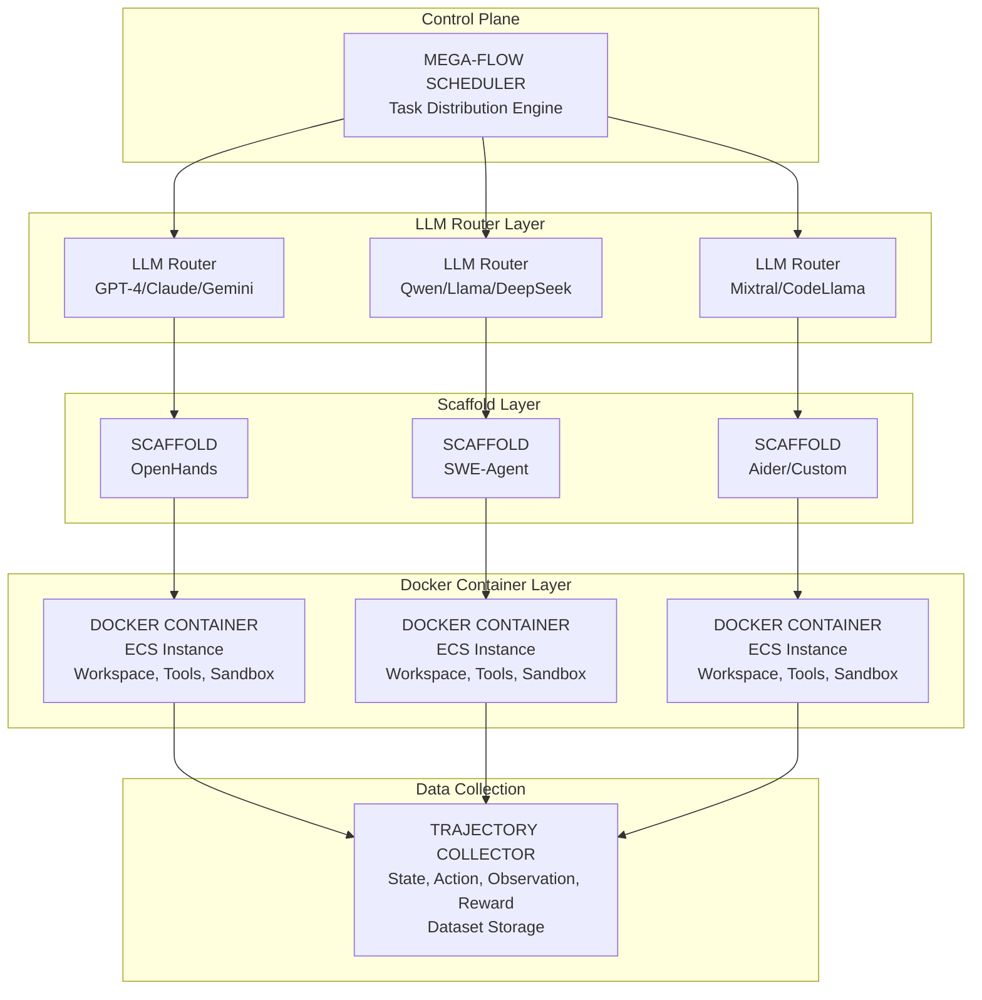

# Synthetic Dataset Generation System - Master Plan

## Executive Summary

This document outlines a comprehensive plan to transform **swe-forge** into a full-scale **Synthetic Dataset Generation System** using Reinforcement Learning with Long Horizon trajectories. The system will leverage Docker containers, multiple LLMs, and specialized scaffolds (OpenHands, SWE-Agent style) to generate high-quality training datasets at scale.

## Table of Contents

1. [System Overview](./01-system-overview.md)
2. [Architecture Design](./02-architecture-design.md)
3. [Docker Infrastructure](./03-docker-infrastructure.md)
4. [LLM Integration Strategy](./04-llm-integration.md)
5. [Scaffold System](./05-scaffold-system.md)
6. [Data Quality Framework](./06-data-quality.md)
7. [Pros and Cons Analysis](./07-pros-cons-analysis.md)
8. [Implementation Roadmap](./08-implementation-roadmap.md)
9. [Function Calls & Tool Calling](./09-function-calls.md)

---

## Current State Assessment

### Existing Infrastructure

| Component | Status | Description |
|-----------|--------|-------------|
| Multi-Agent System | Implemented | 24+ specialized agents (Orchestrator, Ideator, Validator, etc.) |
| Docker Generation | Implemented | Dockerfile/Compose builders with resource limits |
| Template System | Implemented | 100+ YAML templates across 9 categories |
| LLM Integration | Implemented | LiteLLM client with caching |
| Anti-Hardcoding | Implemented | Canary tokens, sealed verification |
| Test Framework | Implemented | Pytest generation, reward scoring |

### Missing Components

| Component | Status | Description |
|-----------|--------|-------------|
| Container Execution | Not implemented | Actual Docker API integration for task execution |
| Multi-LLM Orchestration | Not implemented | Parallel calls to diverse LLMs |
| Trajectory Collection | Not implemented | SARSA-style data collection |
| Persistent Storage | Not implemented | Database for datasets |
| Mega-Flow Scheduler | Not implemented | Large-scale task distribution |
| Scaffold Runtime | Not implemented | OpenHands/SWE-Agent integration |

---

## Target Architecture

---

## Quick Start Reading Path

1. **Understand the Vision**: Start with [System Overview](./01-system-overview.md)
2. **Technical Design**: Read [Architecture Design](./02-architecture-design.md)
3. **Evaluate Trade-offs**: Review [Pros and Cons Analysis](./07-pros-cons-analysis.md)
4. **Quality Concerns**: Study [Data Quality Framework](./06-data-quality.md)
5. **Implementation**: Follow [Implementation Roadmap](./08-implementation-roadmap.md)

---

## Key Decisions to Make

Before implementation, the following strategic decisions need to be made:

| Decision | Options | See Document |
|----------|---------|--------------|
| Container Provider | Docker/Kubernetes/Cloud VMs | [Docker Infrastructure](./03-docker-infrastructure.md) |
| LLM Routing Strategy | Round-robin/Cost-based/Capability-based | [LLM Integration](./04-llm-integration.md) |
| Scaffold Choice | OpenHands/SWE-Agent/Custom | [Scaffold System](./05-scaffold-system.md) |
| Storage Backend | PostgreSQL/MongoDB/S3+Parquet | [Data Quality](./06-data-quality.md) |
| Scale Target | 1K/10K/100K trajectories | [Implementation Roadmap](./08-implementation-roadmap.md) |

---

## Document Status

| Document | Status | Last Updated |
|----------|--------|--------------|
| 01-system-overview.md | Complete | 2025-02-04 |
| 02-architecture-design.md | Complete | 2025-02-04 |
| 03-docker-infrastructure.md | Complete | 2025-02-04 |
| 04-llm-integration.md | Complete | 2025-02-04 |
| 05-scaffold-system.md | Complete | 2025-02-04 |
| 06-data-quality.md | Complete | 2025-02-04 |
| 07-pros-cons-analysis.md | Complete | 2025-02-04 |
| 08-implementation-roadmap.md | Complete | 2025-02-04 |
| 09-function-calls.md | Complete | 2026-02-04 |
